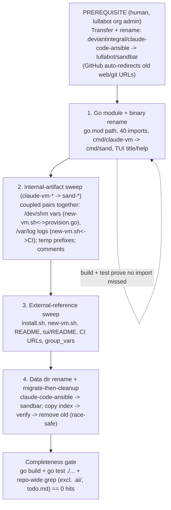
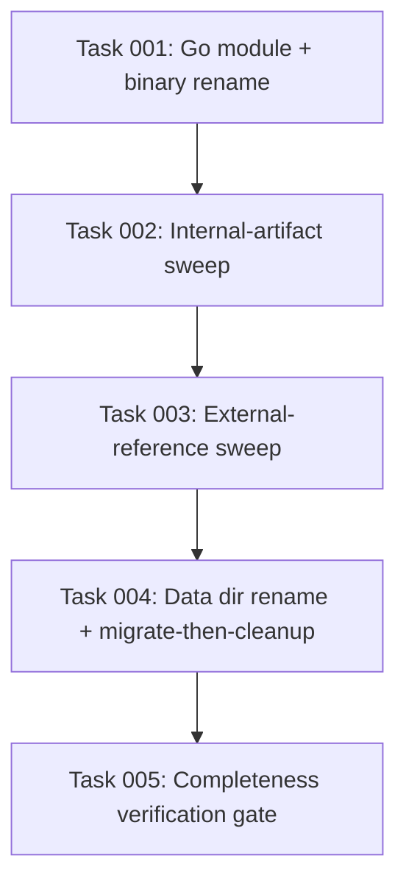

# Plan: Rename to `sandbar` and Move to the lullabot Org

## Original Work Order

> ITEM 5 — Come up with a better name for the repo and the app, and rename to it. Current repo: deviantintegral/claude-code-ansible; current app/binary: claude-vm (Go TUI under tui/). A rename ripples through the Go module path (github.com/deviantintegral/claude-code-ansible/tui), install.sh + README curl|bash URLs, the XDG data dir (~/.local/share/claude-code-ansible, holding managed-vms.json), the CI workflow, and the GitHub repo name. Needs a chosen name + the mechanical rename + any data-dir migration/back-compat.

## Plan Clarifications

| Question | Answer |
|----------|--------|
| What is the new name? | **`sandbar`** — the short CLI binary stays **`sand`**. Coastal/ephemeral metaphor that pairs with Lima's coastal namesake; deliberately avoids "claude" so the tool can manage other AI agents in future. |
| Where does the repo live? | It moves to the **`lullabot`** GitHub organization → **`lullabot/sandbar`** (owner changes from `deviantintegral`, not just the name). |
| How far does the rename go? | **Full rename**: GitHub repo + org, Go module path + all import sites, the app/binary name, the install/CI/doc URLs, and the XDG data dir — with a migrate-then-cleanup of the existing `managed-vms.json`. |
| Namespace safety? | The name must not step on another project's namespace. `sandcastle` and `mayfly` were rejected for in-domain collisions (e.g. `mattpocock/sandcastle` orchestrates sandboxed coding agents). `sandbar` was chosen with no in-domain collision found. |
| How far should the rename reach into **internal** `claude-vm-*` identifiers? | **Full sweep incl. internals** — rename everything: binary/command, TUI title & help, READMEs, URLs, data dir, AND internal artifacts (temp-dir prefixes `claude-vm-reset-*` / `claude-vm-base-*` / `claude-vm.XXXXXX`, the `/dev/shm/...-vars.yml` file, the `/var/log/...-{provision,finalize}.log` paths, and code comments), moving each coupled host↔guest↔CI pair together. The repo-wide grep then legitimately expects **zero** `claude-vm`. |
| Who performs the GitHub org transfer + rename? | **Human prerequisite.** The transfer/rename to `lullabot/sandbar` is a manual GitHub-admin action performed out-of-band by a lullabot org admin (admin access is already arranged). The implementing agent does **only** the code/doc/URL/data-dir changes, targeting the new identity. |
| Has the new identity been verified, and is the binary definitely `sand`? | **Already verified — baked in.** Availability of `lullabot/sandbar` (repo), `lullabot/homebrew-sandbar` (tap), the `github.com/lullabot/sandbar` module path, and `sand` on `PATH` is confirmed. The plan therefore drops the due-diligence gate and the fallback machinery and hardcodes `sandbar` / `sand` (recorded in the Decision Log). |
| What happens to the old `~/.local/share/claude-code-ansible` dir (which is **both** the managed-VM index home **and** the install.sh/new-vm.sh git-clone cache)? | **Migrate then clean up.** Carry `managed-vms.json` forward (copy → verify), then remove the old location — race-safely, so an un-migrated index can never be deleted. |

## Executive Summary

The project's current identity — `deviantintegral/claude-code-ansible`, app binary `claude-vm` — is clunky, undersells the Bubble Tea TUI, ties the brand to "claude" (limiting a future where it manages other agents), and lives under a personal account. This plan rebrands it to **`sandbar`** (binary **`sand`**) and moves it to the **`lullabot`** organization, giving it a clean, agent-neutral, Lima-themed identity. The name and namespace are **pre-verified** (`lullabot/sandbar`, the `lullabot/homebrew-sandbar` tap, the `github.com/lullabot/sandbar` module path, and `sand` on `PATH` are all free), so this plan bakes in the chosen identity rather than gating on a discovery step.

The work is mostly mechanical but cross-cutting, and the clarifications expand its true surface area. It touches the Go module path (`github.com/deviantintegral/claude-code-ansible/tui` → `github.com/lullabot/sandbar/tui`) across its **40 import sites** (in 24 files), the binary/command directory (`tui/cmd/claude-vm` → `tui/cmd/sand`), every external URL in `install.sh`/`scripts/new-vm.sh`/`README.md`/`tui/README.md`/CI, the XDG data dir (`~/.local/share/claude-code-ansible` → `~/.local/share/sandbar`), **and every internal `claude-vm-*` artifact** — including two *coupled* pairs that must move on both sides together: the shared-memory vars file `/dev/shm/claude-vm-vars.yml` (written by `new-vm.sh`, read by `provision.go`) and the guest logs `/var/log/claude-vm-{provision,finalize}.log` (written by `new-vm.sh`, tailed by CI). Because the data dir holds the managed-VM index that gates the safe "recreate" action, the change migrates that index forward and only then cleans up the old location.

The GitHub org transfer + rename is treated as a **human-performed prerequisite** (a lullabot admin does it out-of-band, relying on GitHub's automatic web/git redirects for old URLs); the agent then performs the in-repo rename: Go module + binary, the internal-artifact sweep, the external-URL sweep, and the data-dir rename with a migrate-then-cleanup of the index. Logic risk is low — the Go compiler and existing tests catch broken imports — so the real risks are missed string references (especially the coupled pairs) and the index migration, both explicitly mitigated. This plan is a prerequisite for Plan 07 (the Homebrew tap and headless binary build on the new name, binary, and org).

## Context

### Current State vs Target State

| Current State | Target State | Why? |
|---------------|--------------|------|
| Repo `deviantintegral/claude-code-ansible` under a personal account | Repo `lullabot/sandbar` under the lullabot org (transfer done by a human admin) | Cleaner brand, org ownership, and an agent-neutral name |
| Go module `github.com/deviantintegral/claude-code-ansible/tui` (40 import sites across 24 files) | `github.com/lullabot/sandbar/tui` | Module path must match the repo location to be `go get`-able and self-consistent |
| App/binary `claude-vm`; command dir `tui/cmd/claude-vm`; TUI title/help say `claude-vm` | Binary `sand`; command dir `tui/cmd/sand`; user-facing strings say `sand` | Short, memorable command; drops "claude" for agent-neutrality |
| Internal artifacts named `claude-vm-*`: temp prefixes (`claude-vm-reset-*`, `claude-vm-base-*`, `claude-vm.XXXXXX`), `/dev/shm/claude-vm-vars.yml`, `/var/log/claude-vm-{provision,finalize}.log`, the **persistent** base-version dir `~/.lima/_claude-vm/`, and ~20 code comments | All renamed to `sand-*` / `_sand` (e.g. `/dev/shm/sand-vars.yml`, `/var/log/sand-{provision,finalize}.log`, `~/.lima/_sand/`), with coupled host↔guest↔CI pairs moved together | "Full sweep" scope — the repo-wide grep gate expects zero `claude-vm`; coupled pairs break if only one side moves |
| Install/raw URLs point at `deviantintegral/claude-code-ansible` (install.sh, new-vm.sh, READMEs, CI) | All point at `lullabot/sandbar` | Old URLs must resolve to the new home; raw + module URLs do not redirect reliably |
| Dir `~/.local/share/claude-code-ansible` is **both** the `managed-vms.json` index home **and** the install.sh/new-vm.sh git-clone cache (`CACHE_DIR`) | `~/.local/share/sandbar`, with the index migrated forward and the old location cleaned up race-safely | Keep the managed-VM provenance (which gates recreate) across the rename; don't leave an orphaned clone |
| Brand tied to "claude" | Agent-neutral "sandbar" identity | Leave room to support other AI agents later |

### Background

- **The module path is load-bearing in 40 import lines** across 24 files in `internal/browse`, `internal/lima`, `internal/provision`, `internal/registry`, `internal/ui`, and `cmd/claude-vm`. A single `go.mod` edit plus an import rewrite covers them; the build + `go test ./...` prove completeness.
- **The data dir name appears in three runtime spots**: `install.sh` and `scripts/new-vm.sh` (`CACHE_DIR`) and `internal/registry/registry.go` (`defaultPath`, which builds `managed-vms.json`). All three must move together so the cache and the managed index agree. *Note (clarification):* that dir is not just the index home — `install.sh`/`new-vm.sh` `git clone` the playbook repo **into** `CACHE_DIR`, and `managed-vms.json` sits in the same directory. The migration must account for both.
- **The `claude-vm` string is more than the binary name.** Beyond the command/title/help and READMEs, it appears in internal artifacts, two of which are *coupled across files and must be renamed on both sides together*:
    - `/dev/shm/claude-vm-vars.yml` — **written** by `scripts/new-vm.sh:419`, **read** by `tui/internal/provision/provision.go:27`. Rename to `/dev/shm/sand-vars.yml` on both sides.
    - `/var/log/claude-vm-{provision,finalize}.log` — **written** by `scripts/new-vm.sh:447,462`, **tailed** by CI `.github/workflows/test.yml:118-119`. Rename to `/var/log/sand-{provision,finalize}.log` in the script and the workflow together.
    - Plus uncoupled temp prefixes (`claude-vm-reset-*` in `staging.go`, `claude-vm-base-*` in `provision.go`, `claude-vm.XXXXXX` in `new-vm.sh`) and ~20 code comments/doc strings.
    - Plus one **persistent host-side directory**: `~/.lima/_claude-vm/<base>.playbook-version` (`baseVersionPath` in `tui/internal/provision/baseversion.go`, added after this plan's first refinement) stamps each base image with the playbook version it was built from. Unlike every other internal artifact here, it *survives across runs*, so renaming it carries a one-time migration side-effect (see the sweep stage).
- **GitHub redirects soften the move**: after a transfer/rename, GitHub redirects old web and `git` URLs to the new location, so existing clones and links keep working for a time. Raw content URLs (`raw.githubusercontent.com/...`) and the Go module path do **not** redirect dependably, so the curl|bash one-liners and `go.mod` must be updated outright. (Plan 07 replaces the curl|bash path with `brew` anyway.)
- **No external Go importers** exist — the module is internal to this repo — so changing the module path is safe and needs no version gymnastics.
- **Identity is pre-verified, so there is no due-diligence task and no fallback** (clarification): `lullabot/sandbar`, the `lullabot/homebrew-sandbar` tap, the `github.com/lullabot/sandbar` module path, and `sand` on `PATH` were confirmed free. The chosen identity is recorded in the Decision Log and hardcoded.
- **The GitHub org transfer is a human prerequisite** (clarification): a lullabot org admin transfers `deviantintegral/claude-code-ansible` to the org and renames it to `sandbar` out-of-band (admin access is arranged). The implementing agent does not attempt this; its tasks assume `lullabot/sandbar` exists and only change code/docs/URLs/data-dir.
- **Dependency direction**: Plan 07 (Homebrew tap + headless binary) consumes this plan's outputs (name `sandbar`, binary `sand`, org `lullabot`, tap `lullabot/homebrew-sandbar`). This plan should land first.

## Architectural Approach

The rename is sequenced after one human-performed prerequisite (the GitHub transfer) and then proceeds as in-repo code/doc changes the agent can fully execute and verify. Identity is already confirmed, so there is no discovery/fallback stage.

### Go module and binary rename

**Objective:** Make the code self-consistent under the new module path and command name.

Update the module path in `tui/go.mod`, rewrite the import path across all 40 sites, and rename the command directory `tui/cmd/claude-vm` → `tui/cmd/sand` so the built binary is `sand`. The Go toolchain makes this verifiable: a clean `go build` and a green `go test ./...` prove no import or reference was missed. User-facing strings that name the binary — the TUI title (`titleStyle.Render("claude-vm")` in `internal/ui/list.go`), the package/command doc comments, and any help/status text — are updated in the same pass.

### Internal-artifact sweep (`claude-vm-*` → `sand-*`)

**Objective:** Honor the full-sweep scope so no internal `claude-vm-*` identifier survives, **without breaking the coupled host↔guest↔CI references.**

Rename every internal `claude-vm-*` artifact to `sand-*`. The two coupled pairs are renamed on **both** sides in the same change so the producer and consumer keep agreeing:

- **Shared vars file:** `/dev/shm/claude-vm-vars.yml` → `/dev/shm/sand-vars.yml` in `scripts/new-vm.sh` **and** `tui/internal/provision/provision.go`.
- **Provision/finalize logs:** `/var/log/claude-vm-{provision,finalize}.log` → `/var/log/sand-{provision,finalize}.log` in `scripts/new-vm.sh` **and** `.github/workflows/test.yml`.

Uncoupled artifacts — temp-dir prefixes (`claude-vm-reset-*`, `claude-vm-base-*`, `claude-vm.XXXXXX`) and code comments/doc strings — are renamed in place. The repo-wide grep (below) is the completeness check; the coupled pairs are additionally confirmed by reading both endpoints.

One artifact needs a **migration note** because it persists: `~/.lima/_claude-vm/<base>.playbook-version` (`baseVersionPath` in `tui/internal/provision/baseversion.go`) is a host-side directory recording which playbook version each base image was built from. Renaming the directory to `_sand` is a one-line change, but — unlike the ephemeral temp/`/dev/shm`/`/var/log` artifacts — it survives across runs, so existing stamps stay under the old `_claude-vm` name. On first run after the rename the TUI finds no stamp under `_sand`, treats each pre-existing base image as stale, and **rebuilds it once**. This self-heals with no data loss and needs no migration code, but the one-time rebuild should be called out so it isn't mistaken for a regression. (A copy-forward like the `managed-vms.json` index migration is optional and not required.)

### External-reference sweep

**Objective:** Repoint every non-Go, non-internal reference to the new identity.

Sweep `install.sh`, `scripts/new-vm.sh`, `README.md`, `tui/README.md`, the CI workflow, and any `group_vars`/docs for `deviantintegral`, `claude-code-ansible`, and `claude-vm`, replacing repo/raw URLs, the cache/data-dir name, and the app name. A repository-wide grep for the old identity strings — **excluding `.ai/task-manager/` planning docs and `todo.md`, which legitimately reference the old names** — is the completeness check.

### Data dir rename and migrate-then-cleanup

**Objective:** Adopt `~/.local/share/sandbar` without losing the managed-VM index, and remove the old location once migration is proven.

Point `CACHE_DIR` (install.sh, new-vm.sh) and `registry.defaultPath` at `sandbar`. The old dir doubles as the managed-VM index home **and** the playbook git-clone cache, so migration + cleanup is split by owner and gated so an un-migrated index can never be destroyed:

- **Index (owned solely by the TUI, `registry.go` load path):** if `~/.local/share/sandbar/managed-vms.json` is absent but `~/.local/share/claude-code-ansible/managed-vms.json` exists, **copy** it forward, verify the new file reads back correctly, **then** remove the old index file. If the old dir is empty afterwards, `rmdir` it. Copy-before-remove means a crash mid-migration cannot lose the index.
- **Clone cache (owned by the shell scripts):** `install.sh`/`new-vm.sh` clone into the new `sandbar` `CACHE_DIR`. They remove the old `claude-code-ansible` dir **only when it no longer contains a `managed-vms.json`** — i.e., after the TUI has migrated it (or it never existed). This guard makes cleanup race-safe regardless of whether the TUI or the shell runs first: the shell never deletes a dir that still holds an un-migrated index. *(Plan 07 deletes these scripts, so this shell-side cleanup is interim.)*

## Risk Considerations and Mitigation Strategies

Technical Risks

- **Missed string references** to the old name/URLs leave dead links or a split-brain data dir.
    - **Mitigation**: a repo-wide grep for `deviantintegral`, `claude-code-ansible`, and `claude-vm` (excluding `.ai/task-manager/` and `todo.md`) as the completeness gate; the Go build + tests catch every import.
- **A coupled pair is renamed on only one side** — e.g. `new-vm.sh` writes `/dev/shm/sand-vars.yml` but `provision.go` still reads the old path, or CI tails a log the script no longer writes — silently breaking provisioning or log capture.
    - **Mitigation**: rename each coupled pair (`/dev/shm` vars; `/var/log` logs) on both endpoints in the same change and confirm by reading both sides; the lima-e2e CI job exercises the real provisioning path end-to-end.
- **Index migration could orphan or lose the managed index**, breaking the recreate safety gate — aggravated because the old dir is also the clone cache that the shell scripts may delete.
    - **Mitigation**: the TUI is the *sole* owner of index migration (copy → verify → remove old, `rmdir`-if-empty); the shell cleanup deletes the old dir **only when no `managed-vms.json` remains in it**, so an un-migrated index is never destroyed regardless of run order.
- **Raw/module URLs don't follow GitHub redirects**, so curl|bash and `go get` would break if left stale.
    - **Mitigation**: update them outright; note that Plan 07 retires the curl|bash path in favour of `brew`.

Implementation Risks

- **Org transfer is a human prerequisite outside the codebase** and gates the URL edits' correctness.
    - **Mitigation**: a lullabot org admin performs the transfer/rename out-of-band (access already arranged); the agent's tasks assume `lullabot/sandbar` and are sequenced after it. GitHub redirects keep old web/git URLs resolving in the interim.

## Success Criteria

### Primary Success Criteria

1. The repository lives at `lullabot/sandbar` (human-performed transfer); old `deviantintegral/claude-code-ansible` web/git URLs redirect to it.
2. `go build` produces a `sand` binary and `go test ./...` passes, with no remaining `deviantintegral/claude-code-ansible` import paths anywhere in the module.
3. A repository-wide search (excluding `.ai/task-manager/` and `todo.md`) finds **zero** `deviantintegral`, `claude-code-ansible`, or `claude-vm` references — including internal artifacts; all point at `lullabot/sandbar` / `sand`. The two coupled pairs (`/dev/shm/sand-vars.yml`; `/var/log/sand-{provision,finalize}.log`) are renamed consistently on both producer and consumer sides.
4. The data dir is `~/.local/share/sandbar`; a pre-existing `claude-code-ansible` managed index is migrated automatically on first run with no loss of managed/recreate state, and the old location is cleaned up only after the index is confirmed migrated.
5. The confirmed identity (`lullabot/sandbar`, binary `sand`, module path `github.com/lullabot/sandbar`, tap `lullabot/homebrew-sandbar`) is recorded in the Decision Log and applied consistently; no fallback/alternative name remains in the tree.

## Documentation

- **README.md**, **tui/README.md** — repo name, URLs, app/binary name, and data-dir references throughout (incl. the `claude-vm` mentions in titles, tables, and prose).
- **install.sh** / **scripts/new-vm.sh** headers and `CACHE_DIR` — new URLs and dir (note: Plan 07 may remove these files entirely).
- Any **group_vars**/example/CONTRIBUTING references to the old identity.

## Resource Requirements

### Development Skills

- Go (module path + import rewrite, command-dir rename) and confidence reading the build/test signal as the completeness check.
- GitHub org administration on `lullabot` (the human-performed repo transfer + rename, and redirect behaviour).

### Technical Infrastructure

- Existing Go toolchain; no new dependencies. A grep/replace sweep and a CI run (including the lima-e2e job, which exercises the coupled provisioning paths) to confirm green after the rename.

## Integration Strategy

This plan is the foundation for Plan 07: the Homebrew tap (`lullabot/homebrew-sandbar`), the release artifacts, and the headless binary all assume the `sandbar` name, the `sand` binary, and the `lullabot` org established here. Plans 08 (CI testing) and 09 (Samba share) are independent of the rename but will inherit the new module path and URLs once this lands. To avoid churn, this rename should be completed before Plan 07 begins.

## Notes

- The org move (`deviantintegral` → `lullabot`) is as significant as the name change — both owner and name change — so URL updates must reflect the new owner, not just the new repo name.
- Keep the old `deviantintegral` repo as a redirect stub rather than deleting it, so bookmarked links and existing clones continue to resolve during the transition.

### Decision Log

- **Identity (pre-verified, hardcoded):** repo `lullabot/sandbar`; binary/command `sand`; Go module `github.com/lullabot/sandbar`; XDG data dir `~/.local/share/sandbar`; Homebrew tap (for Plan 07) `lullabot/homebrew-sandbar`. Availability of all four namespaces (repo, tap, module path, `sand` on `PATH`) confirmed before this refinement; the due-diligence task and fallback name are therefore dropped.
- **GitHub org transfer = human prerequisite:** performed by a lullabot org admin out-of-band (admin access arranged). The implementing agent does not run it (e.g. no `gh repo transfer`); agent tasks target the new identity and are sequenced after the transfer.
- **Internal-artifact naming convention:** `claude-vm-*` → `sand-*` (`/dev/shm/sand-vars.yml`, `/var/log/sand-{provision,finalize}.log`, `sand-reset-*`, `sand-base-*`, `sand.XXXXXX`); the persistent host dir `~/.lima/_claude-vm/` → `~/.lima/_sand/` (one-time base-image rebuild on first run after the rename — see the Internal-artifact sweep stage).

### Change Log

- 2026-07-03: Staleness refresh against `main` after Plans 05 (search/disk) and 10 (file transfer) landed. (1) Corrected the Go import-site count from **36 across 19 files** to **40 across 24 files** — new TUI files (`internal/browse/lister.go`, `internal/ui/{transfer,commands,form,progress}.go` and their tests) added import sites — in the frontmatter, Executive Summary, Current/Target table, Background, mermaid label, and sweep stage. (2) Added the **persistent host-side artifact** `~/.lima/_claude-vm/` (`baseVersionPath` in `internal/provision/baseversion.go`, added 2026-07-02) to the internal-artifact sweep, the Current/Target table, Background, and Decision Log, with a migration note that renaming it to `_sand` triggers a one-time base-image rebuild. Re-verified as still accurate (no change needed): the two coupled-pair line references (`new-vm.sh:419`↔`provision.go:27`; `new-vm.sh:447,462`↔`test.yml:118,119`), the temp prefixes, `tui/cmd/claude-vm`, and the external URL / data-dir references.
- 2026-06-30: Refinement session. (1) Expanded rename scope to a full internal sweep of `claude-vm-*` artifacts and identified the two coupled host↔guest↔CI pairs (`/dev/shm` vars file; `/var/log` provision/finalize logs) that must move on both sides — added a dedicated Internal-artifact sweep stage and a coupled-pair risk. (2) Reframed the GitHub org transfer as a human-performed prerequisite (not an agent task) and removed the org-admin-rights implementation risk in favour of a prerequisite note. (3) Dropped the namespace due-diligence stage and fallback (identity pre-verified) and recorded the confirmed identity in a new Decision Log. (4) Changed the data-dir migration to migrate-then-cleanup, corrected the doc to note the dir is also the git-clone cache, and specified a race-safe cleanup guard (shell deletes the old dir only when no `managed-vms.json` remains). (5) Scoped the completeness grep to exclude `.ai/task-manager/` and `todo.md`. Updated the mermaid diagram, Current/Target table, Success Criteria, and frontmatter summary accordingly.

## Task Dependency Diagram

The rename is intentionally sequential: `scripts/new-vm.sh`, `install.sh`, `tui/internal/registry/registry.go`, and `tui/internal/provision/provision_test.go` are each touched by more than one stage, so running stages in parallel would break task isolation. This matches the plan's linear P→A→B→C→D→V flow.

## Execution Blueprint

**Validation Gates:**
- Reference: `/config/hooks/POST_PHASE.md`

### ✅ Phase 1: Go module + binary rename
**Parallel Tasks:**
- ✔️ Task 001: Rewrite the Go module path (`go.mod` + 46 imports across 24 files), `git mv tui/cmd/claude-vm → tui/cmd/sand`, and update user-facing `claude-vm` app-name strings/comments in `internal/ui` + `registry.go` comments.

### ✅ Phase 2: Internal-artifact sweep
**Parallel Tasks:**
- ✔️ Task 002: Rename every internal `claude-vm-*` artifact to `sand-*` — the two coupled pairs (`/dev/shm/sand-vars.yml`; `/var/log/sand-{provision,finalize}.log`) on both endpoints, temp prefixes, and `~/.lima/_sand/`. (depends on: 001)

### ✅ Phase 3: External-reference sweep
**Parallel Tasks:**
- ✔️ Task 003: Repoint repo/raw URLs, org, app name, and data-dir prose to `lullabot/sandbar` / `sand` across `install.sh`, `new-vm.sh`, `README.md`, `tui/README.md`, and the Go repo-URL test fixtures. (depends on: 002)

### ✅ Phase 4: Data dir rename + migrate-then-cleanup
**Parallel Tasks:**
- ✔️ Task 004: Point `registry.defaultPath` + shell `CACHE_DIR` at `sandbar`; migrate the managed index (copy→verify→remove) and race-safely clean up the old dir. (depends on: 003)

### Phase 5: Completeness verification gate
**Parallel Tasks:**
- Task 005: `go build`/`vet`/`fmt`/`test`, `shellcheck`, and the repo-wide zero-hit grep; confirm coupled pairs. (depends on: 004)

### Post-phase Actions
After each phase: lint passes and a conventional commit is created (POST_PHASE). After all phases: POST_EXECUTION validation, execution summary, and archival.

### Execution Summary
- Total Phases: 5
- Total Tasks: 5
- Maximum Parallelism: 1 task (each phase)
- Critical Path Length: 5 phases
