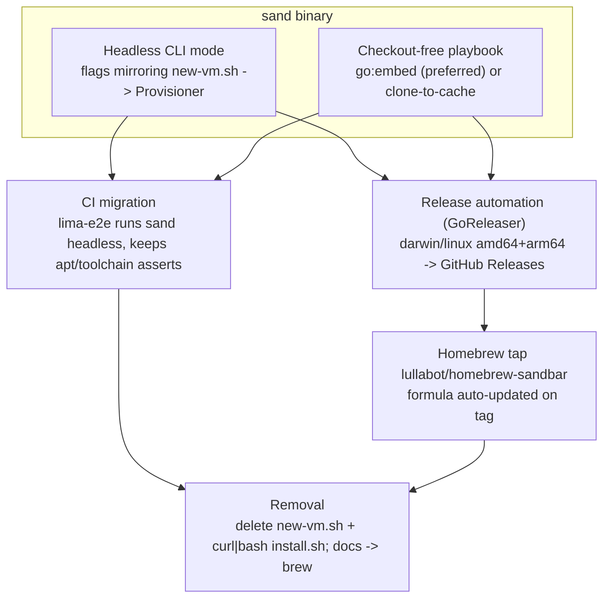

# Plan: Retire `new-vm.sh`, Distribute `sand` via a Homebrew Tap

## Original Work Order

> ITEM 6 — Remove the bash script (scripts/new-vm.sh) once the TUI has it all. Currently new-vm.sh is the entry point for curl|bash (install.sh), Homebrew, and the CI lima-e2e job, and it has a full non-interactive flag set (--name, --yes, --git-name, --cpus, --memory, --disk, --recreate, --rebuild, etc.). The TUI is interactive-only and must run from a checkout. Removal is blocked on closing this parity gap (a headless/non-interactive mode + an install/bootstrap path that doesn't require Go, + migrating CI off new-vm.sh).

## Plan Clarifications

| Question | Answer |
|----------|--------|
| How should a Go-free user install the tool once `new-vm.sh` is gone? | **A Homebrew tap** (`lullabot/homebrew-sandbar`) distributing the prebuilt `sand` binary. There is no existing Homebrew formula today — only `install.sh` + `new-vm.sh`. |
| What is the end state for the bash script? | A **headless `sand` mode + released binaries**, CI migrated to the binary, then **`scripts/new-vm.sh` and the curl|bash `install.sh` are removed**. |
| Dependencies? | Builds on **Plan 06** (name `sandbar`, binary `sand`, org `lullabot`). The headless mode also requires the binary to obtain the playbook **without a checkout**. |

## Executive Summary

`scripts/new-vm.sh` is currently the only non-interactive, Go-free entry point: `install.sh` (curl|bash) execs it, and the CI `lima-e2e` job drives it with its full flag set. The TUI, by contrast, is interactive-only and must run from a repository checkout. Retiring the bash script therefore requires closing three gaps first: the `sand` binary needs (1) a **headless, non-interactive provisioning mode** that mirrors `new-vm.sh`'s flags, and (2) a way to **obtain the playbook without a checkout**; plus (3) an **easy, Go-free install** to replace curl|bash.

The chosen distribution is a **Homebrew tap** built with **GoReleaser**: tagging a release cross-compiles `sand` for macOS/Linux (amd64/arm64), publishes binaries to GitHub Releases, and updates the formula in `lullabot/homebrew-sandbar` so users run `brew install lullabot/sandbar/sand`. Once the headless path exists and CI provisions via the installed binary (reproducing the existing apt-keyring and toolchain assertions), `scripts/new-vm.sh` and the curl|bash `install.sh` are deleted and the docs switch to `brew`.

This consolidates two parallel implementations (a 22 KB bash provisioner and the Go provisioner) down to one Go codebase, removing the drift risk between them while keeping every capability `new-vm.sh` offered. It depends on Plan 06 and shares CI edits with Plan 08, so those touchpoints are sequenced explicitly.

## Context

### Current State vs Target State

| Current State | Target State | Why? |
|---------------|--------------|------|
| Non-interactive provisioning lives only in `new-vm.sh` (flags: `--name`, `--yes`, `--git-name/-email`, `--cpus/--memory/--disk`, `--clone-url/--clone-token`, `--recreate`, `--rebuild`, `--base-name`, …) | A headless `sand` mode covering the same flags | CI and scripted users need non-interactive provisioning without the TUI |
| The binary requires a repo checkout (walks up to `site.yml`) | The binary obtains the playbook without a checkout (embedded or cloned-to-cache) | A Homebrew-installed binary has no checkout to mount |
| Install = `curl … install.sh | bash` (clones repo, execs `new-vm.sh`) | Install = `brew install lullabot/sandbar/sand` | A Go-free, one-command install on macOS + Linux |
| CI `lima-e2e` runs `new-vm.sh --yes …` | CI `lima-e2e` runs the installed/built `sand` headless | Exercise the real entry point that ships to users |
| Two provisioners maintained (bash + Go) | One (Go) | Eliminate drift and duplicated logic |

### Background

- **`new-vm.sh` flag surface** is the parity checklist (enumerated above from its `usage()`), including the base-image `--rebuild` and per-VM `--recreate` flows the Go provisioner already implements internally (`provision.Provisioner` + `vm.CreateConfig` + the managed registry). The headless mode is largely a CLI front-end over code that already exists.
- **Playbook acquisition is the crux.** The provisioner runs the playbook *inside the guest* by rsyncing from `/mnt/playbook` (a host copy Lima mounts). Today that host copy is the checkout (repo mode) or a clone-to-cache (curl|bash mode, via `install.sh`). A checkout-free binary must supply the playbook itself — either by **embedding it** (`go:embed`) and writing it to a temp dir to mount, which keeps playbook and binary versioned together, or by **cloning the repo to the cache dir** as `install.sh` does today.
- **CI does more than run the script**: `lima-e2e` asserts the apt keyrings are `_apt`-readable and smoke-tests the toolchain. The headless path must reproduce the same guest result so those assertions keep passing after migration.
- **There is no Homebrew formula yet** — only `install.sh`. "Homebrew" appears only in comments/docs. So this introduces the tap rather than migrating an existing formula.
- **Dependencies**: requires Plan 06 (the `sand` binary, `sandbar` name, `lullabot` org, and tap repo). It edits the same CI workflow as Plan 08, so the workflow changes must be coordinated.

## Architectural Approach

### Headless (non-interactive) CLI mode

**Objective:** Let `sand` provision a VM with no TUI and no prompts, matching `new-vm.sh`.

Add a non-interactive command/flag mode to the binary that accepts the same inputs `new-vm.sh` exposes and drives the existing `provision.Provisioner` create / recreate / rebuild flows, streaming progress to stdout instead of the Bubble Tea panes. It reuses `vm.CreateConfig`, the validation rules, and the managed registry, so behaviour (including secret-over-stdin hygiene) matches the interactive path. The `new-vm.sh` `usage()` flag list is the explicit parity checklist.

### Checkout-free playbook acquisition

**Objective:** Make the binary self-sufficient when installed via Homebrew, with no repo on disk.

Provide the playbook to the in-guest run without relying on a checkout. The preferred approach **embeds the playbook into the binary** (`go:embed`) and materialises it to a temp dir for Lima to mount, keeping the playbook and binary in lockstep per release; the alternative **clones the repo to the cache dir** (mirroring today's `install.sh`). The decision is recorded in the plan; either way the existing in-guest rsync/run and secret handling are preserved.

### Release automation and the Homebrew tap

**Objective:** Ship `sand` as a one-command install on macOS and Linux.

Use GoReleaser to cross-compile `sand` for darwin/linux on amd64/arm64, attach the artifacts to GitHub Releases on tag, and auto-update the formula in the `lullabot/homebrew-sandbar` tap so `brew install lullabot/sandbar/sand` works. This replaces the curl|bash install convenience with a maintained binary channel.

### CI migration and removal

**Objective:** Prove the binary covers the script, then delete the script.

Repoint the `lima-e2e` job to install/build and run `sand` headless in place of `new-vm.sh`, retaining the apt-keyring-readable and toolchain smoke-test assertions so equivalence is enforced. Once green, remove `scripts/new-vm.sh` and the curl|bash `install.sh`, and update the README quick-start and `tui/README` "relationship to new-vm.sh" to the `brew` story.

## Risk Considerations and Mitigation Strategies

Technical Risks

- **Headless parity gaps** (a flag, default, or re-run hint the bash script had).
    - **Mitigation**: treat `new-vm.sh`'s `usage()` as the checklist; the migrated `lima-e2e` job asserts an equivalent provisioned guest.
- **Embedding the playbook drifts from the repo or bloats the binary.**
    - **Mitigation**: `go:embed` versions the playbook with the binary at build time; the playbook is small YAML, so size impact is negligible.
- **Reproducing the exact guest result** (e.g. the apt-keyring umask fix) under the new path.
    - **Mitigation**: keep the same in-guest script/vars-over-stdin mechanism; retain the CI assertions that originally caught that bug.

Implementation Risks

- **Homebrew tap + GoReleaser credentials/scopes** (a token that can push to the tap repo).
    - **Mitigation**: use GoReleaser's Homebrew publisher with a scoped token to `lullabot/homebrew-sandbar`; validate on a pre-release tag.
- **Losing curl|bash users who don't use Homebrew.**
    - **Mitigation**: `brew` runs on macOS and Linux; document the switch. Optionally retain a one-line bootstrap that installs via brew, but keep no provisioning logic in bash.
- **CI workflow edited by two plans** (07 and 08).
    - **Mitigation**: coordinate so the test workflow is changed once, with the go-test/coverage jobs (Plan 08) and the binary-based e2e (this plan) landing consistently.

## Success Criteria

### Primary Success Criteria

1. `sand` performs a complete non-interactive create — equivalent to `new-vm.sh --yes --name … --git-name … --cpus … --memory … --disk …` — with **no checkout present** on the host.
2. `brew install lullabot/sandbar/sand` installs a working binary on macOS and Linux, and pushing a release tag auto-updates the tap formula via GoReleaser.
3. CI `lima-e2e` provisions via the `sand` binary (not `new-vm.sh`) and still passes the apt-keyring-readable and toolchain smoke-test assertions.
4. `scripts/new-vm.sh` and the curl|bash `install.sh` are removed, the docs install via `brew`, and no references to the deleted scripts remain.

## Documentation

- **README.md** — quick-start rewritten around `brew install`; remove curl|bash instructions.
- **tui/README.md** — rewrite the "Relationship to new-vm.sh" section; document the headless mode and how the playbook is obtained.
- **Release/tap docs** — how releases are cut (GoReleaser) and how the tap is maintained.

## Resource Requirements

### Development Skills

- Go (CLI/flag front-end over the existing provisioner; `go:embed`), GoReleaser configuration, and Homebrew tap mechanics.
- GitHub Actions for the release workflow and the migrated `lima-e2e` job.

### Technical Infrastructure

- A `lullabot/homebrew-sandbar` tap repo and a release token, GoReleaser, and a Lima-capable CI runner (the existing `lima-vm/lima-actions` setup) for the binary-based e2e.

## Integration Strategy

Depends on **Plan 06** for the name, binary, org, and tap location. Shares the CI test workflow with **Plan 08**, so the e2e migration here and the go-test/coverage jobs there are landed together to avoid conflicting edits. Independent of **Plan 09**.

## Notes

- Keep the in-guest secret hygiene (Ansible vars streamed over stdin into tmpfs, never argv) in the headless path — it is part of the security posture, not just an implementation detail.
- The `go:embed` vs clone-to-cache choice is the one genuinely architectural decision here; embedding is preferred for self-containment and lockstep versioning and should be the default unless a reason to clone emerges during implementation.
