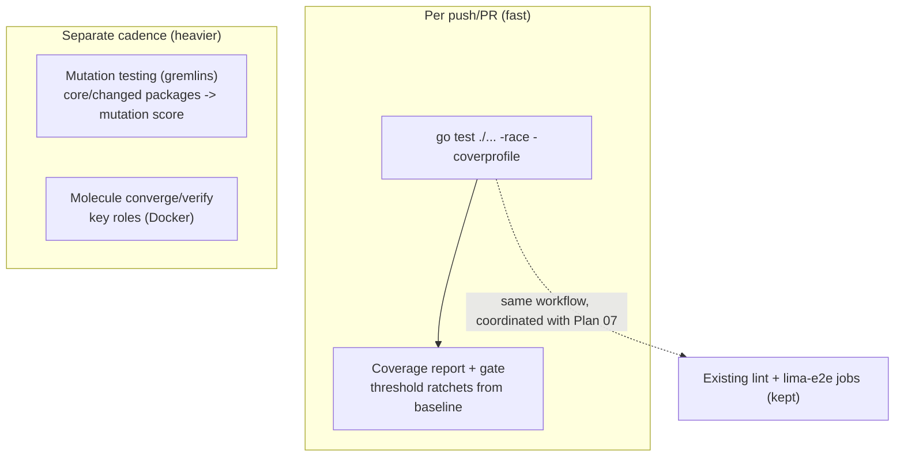

# Plan: CI Test Coverage — Go Tests, Coverage Gate, Mutation Testing, Ansible Role Tests

## Original Work Order

> ITEM 7 — Unit tests / code coverage / mutation testing. The TUI has substantial Go *_test.go coverage but CI (.github/workflows/test.yml) does NOT run go test — it only does shellcheck, ansible syntax-check, and a Lima e2e run via new-vm.sh. Want: wire Go tests into CI, coverage reporting, and evaluate mutation testing (e.g. gremlins for Go); possibly Ansible role tests.

## Plan Clarifications

| Question | Answer |
|----------|--------|
| What should the testing plan cover? | **All four**: (1) run the Go tests in CI, (2) coverage reporting **plus an enforced gate**, (3) **mutation testing** for the Go code (e.g. gremlins), and (4) **Ansible role tests** (e.g. molecule) beyond the current syntax-check. |

## Executive Summary

The TUI carries a substantial Go test suite (`*_test.go` across `lima`, `provision`, `registry`, `ui`, and `vm`), but CI never runs it: `.github/workflows/test.yml` only shellchecks the bash, syntax-checks the playbook, and runs a real-VM `lima-e2e` provision. So a regression in the Go orchestration can reach `main` with the unit tests entirely unexecuted in CI. This plan closes that gap and then strengthens the signal beyond mere pass/fail.

Four layers are added: a fast **Go test job** (`go test ./... -race`) on every push/PR; **coverage reporting with an enforced threshold** that starts at the measured baseline and ratchets upward; **mutation testing** (gremlins) as a separate, slower, advisory signal that measures how effective the tests actually are rather than just which lines they touch; and **Ansible role tests** (molecule converge/verify) for the highest-value roles, going beyond today's syntax-check. The fast Go job guards every change; the heavier mutation and molecule jobs run on their own cadence so they add confidence without slowing the inner loop.

The result is that the existing tests finally protect `main`, coverage is visible and can only improve, mutation testing reveals weak assertions, and role behaviour (not just YAML validity) is exercised. This plan shares `test.yml` with Plan 07 (which migrates `lima-e2e` to the `sand` binary), so the workflow edits are coordinated; it is otherwise independent.

## Context

### Current State vs Target State

| Current State | Target State | Why? |
|---------------|--------------|------|
| Go unit tests exist but run only locally | `go test ./... -race` runs in CI on every push/PR; failures block merge | Regressions in the Go provisioner/registry/UI currently reach `main` unguarded |
| No coverage measurement | Coverage measured, reported per run, and gated at a threshold (ratcheting from baseline) | Make coverage visible and monotonically improving |
| Test effectiveness unknown | Mutation testing (gremlins) reports a mutation score | Line coverage alone can hide weak/missing assertions |
| Ansible validated by syntax-check only | Molecule converge/verify for key roles | Catch role behaviour regressions, not just YAML validity |

### Background

- **`test.yml` today** has two jobs: `lint` (shellcheck + `ansible-playbook --syntax-check`) and `lima-e2e` (a full real-VM provision via `new-vm.sh`, the slow job). There is no Go job at all.
- **The Go module** lives under `tui/` (go 1.24) with tests spread across the internal packages; some (e.g. `provision/lima_e2e_test.go`) are gated behind a real-Lima build tag and should stay out of the fast unit job.
- **Mutation testing is inherently slow** (it recompiles and reruns tests per mutant), so it belongs in a separate job — scheduled or scoped to core/changed packages — and is advisory rather than a merge gate at first.
- **Molecule needs Docker**, and several roles (`base`, `user`, `samba`, `dev-tools`) manage services via systemd, which constrains container images (systemd-enabled images or scenario scoping). The plan accounts for this rather than assuming every role converges cleanly in a plain container.
- **Coordination**: Plan 07 also edits `test.yml` (repointing `lima-e2e` to the `sand` binary). The workflow should be changed once, consistently. Plan 06's rename changes the module path the Go job builds, so this plan inherits whatever name is current when it lands.

## Architectural Approach

### Go unit tests in CI

**Objective:** Make the existing suite actually guard `main`.

Add a job that runs `go test ./... -race` for the `tui/` module on every push and PR, with Go module/build caching for speed, excluding the real-Lima-gated tests. This is the essential, fast guard and the foundation the other three layers build on.

### Coverage reporting and gate

**Objective:** Make coverage visible and monotonically improving.

Collect a coverage profile from the test run, surface it (a per-run summary/artifact, optionally a PR annotation or an external coverage service), and enforce a minimum threshold. The threshold starts at the **currently measured baseline** so the gate is immediately green, then ratchets upward as coverage improves; glue code with little value to test (e.g. `main`) can be excluded so the number reflects meaningful coverage.

### Mutation testing

**Objective:** Measure how good the tests are, not just how much code they touch.

Evaluate and wire up Go mutation testing (gremlins): run it on the core packages (and/or changed packages) as a **separate, slower job**, reporting a mutation score and surviving mutants as an advisory signal. It stays non-blocking initially so it informs test improvements without destabilising the merge gate, with documentation on running it locally.

### Ansible role tests

**Objective:** Exercise role behaviour beyond syntax validity.

Add molecule scenarios (converge + verify) for the highest-value roles, run in CI with Docker, while keeping the existing `--syntax-check`. Where a role needs systemd (e.g. `samba`, `dev-tools`), use a systemd-capable approach or scope the scenario accordingly, documenting any role that can't be fully converged in a container.

## Risk Considerations and Mitigation Strategies

Technical Risks

- **Slow or flaky CI** from `-race`, mutation runs, and molecule.
    - **Mitigation**: keep the unit+coverage job fast and blocking; run mutation and molecule on a separate cadence (scheduled/changed-scope), with Go and Docker layer caching.
- **Systemd-in-Docker friction** for service-managing roles under molecule.
    - **Mitigation**: use systemd-enabled images or scope scenarios to what converges reliably; document roles that can't be fully containerised.
- **Mutation tooling maturity** (gremlins false positives/timeouts).
    - **Mitigation**: treat the mutation score as advisory, not a gate; scope it to core packages first.

Implementation Risks

- **Coverage gate causes friction** if set too high.
    - **Mitigation**: anchor the threshold at the measured baseline and ratchet; exclude low-value glue from the denominator.
- **Workflow edited by two plans** (07 migrates `lima-e2e`; this adds jobs).
    - **Mitigation**: make `test.yml` changes once, coordinated, so the jobs compose cleanly.

## Success Criteria

### Primary Success Criteria

1. Every push/PR runs `go test ./... -race` for the `tui/` module, and a failure blocks merge.
2. Coverage is measured and reported on each run, with an enforced threshold that starts at the baseline and can only ratchet up.
3. A mutation-testing job (gremlins) runs on the core packages and reports a mutation score, with documented local usage.
4. Molecule converge/verify tests exist and run in CI for at least the key roles, alongside the retained syntax-check.

## Documentation

- **tui/README.md** — a testing section: how to run unit tests, coverage, and mutation testing locally.
- **Role/test docs** — how to run molecule scenarios; any role-specific containerisation caveats.
- **CONTRIBUTING** (or equivalent) — the coverage-gate expectation for new code.

## Resource Requirements

### Development Skills

- Go testing/coverage tooling and gremlins; GitHub Actions (caching, job matrices, scheduled jobs); molecule + Docker and Ansible role testing.

### Technical Infrastructure

- GitHub Actions runners with Docker (molecule) and Go; optionally an external coverage service for reporting/trend.

## Integration Strategy

Shares `.github/workflows/test.yml` with **Plan 07** (binary-based `lima-e2e`); the workflow is edited once so the new go-test/coverage/mutation/molecule jobs and the migrated e2e coexist. Inherits the module path from **Plan 06** if that lands first. Independent of **Plan 09**.

## Notes

- The fast `go test -race` job is the highest-value, lowest-cost piece and the immediate win; coverage gate, mutation testing, and molecule layer additional confidence on top of it.
- Keep the existing `lima-e2e` job — unit tests and role tests do not replace the real-VM end-to-end signal.
