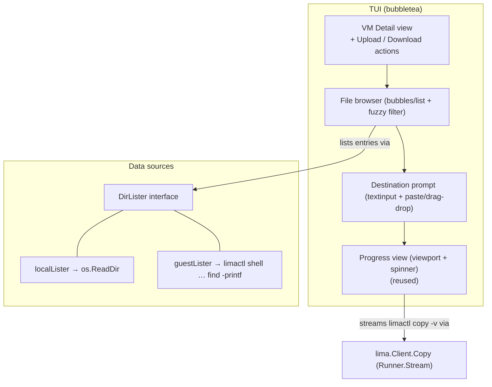
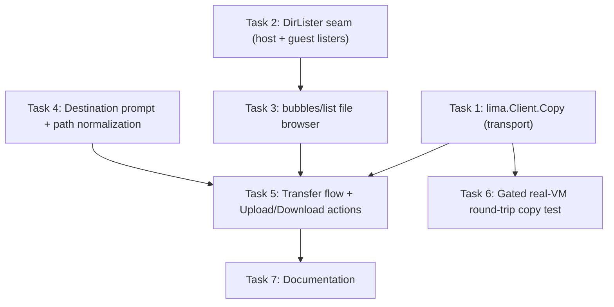

# Plan: Built-in File-Transfer UI for the claude-vm TUI

## Original Work Order

> Build a built-in file-transfer (upload/download) UI in the `claude-vm` Go TUI to move files between the host and a Lima guest VM, replacing the manual `limactl copy` workflow. This SUPERSEDES the deferred plan-09 "writable Samba share" approach and addresses the same original work order (ITEM 8: share content out from VMs to the host, replace limactl copy). If helpful, treat plan 09 as retired/replaced by this plan.
>
> **Motivation & security posture (the key win):** The project's posture is "nothing leaves the VM": VMs are ephemeral, there is NO writable host mount, and `limactl delete` provably removes everything. Every "live folder" alternative evaluated (writable SMB/Samba over a vmnet network, sshfs, host port-forward of 445) punches a STANDING hole in that isolation and drags in platform-specific networking and credentials (socket_vmnet, shared/hashed SMB password with pass-the-hash risk, macFUSE, macOS localhost-SMB quirks). A discrete copy UI achieves the file-movement goal with none of that: each transfer is an explicit, one-shot, user-initiated action — no standing share, no new network surface, no new credentials, no mount. Isolation stays the default; we deliberately trade the "live/mounted folder" UX for keeping the posture intact. It is also cross-platform identical (works wherever limactl works).
>
> **Transport:** Wrap `limactl copy` (Lima 2.1.3 verified flags: `-r/--recursive`, `--backend=auto` which prefers rsync with resume and falls back to scp, and `-v/--verbose`; guest paths are prefixed `<vm>:`). Add a `Copy` method to the existing `lima.Runner` abstraction in tui/internal/lima (interface has Output + Stream and is already faked in tests), backed by `Stream` running `limactl copy -v` so progress streams live. Existing pattern to follow: ui/commands.go shells out to `limactl shell`.
>
> **UI & components (all from bubbles v1.0.0, already a dependency):** Add Upload and Download actions on the individual VM detail screen. Build ONE custom file browser on `bubbles/list` (chosen for its built-in fuzzy filtering), used for BOTH host and guest sides so the UI is consistent. Deliberately do NOT use the stock `filepicker` component: it is hardwired to `os.ReadDir`/`os.Stat`, re-reads the host OS on every navigation, and stores entries in an unexported field, so it cannot display guest files. Decouple the browser from its data source with a pluggable `DirLister` interface (`List(ctx, path) ([]DirEntry, error)` where DirEntry has Name/IsDir/Size): a `localLister` wrapping `os.ReadDir` (host) and a `guestLister{vm}` running `limactl shell <vm> -- find <dir> -mindepth 1 -maxdepth 1 -printf '%y\t%s\t%f\n'` (type/size/name, single SSH round-trip; GNU findutils dependency). Support drag-and-drop path entry via a `textinput` fed by bracketed paste, normalizing shell-escaping (backslash-escaped spaces, quotes, optional `file://`), kept as a secondary convenience. Stream `limactl copy -v` output to the viewport, reusing the streaming-to-viewport plumbing already added for provision output plus the existing spinner.
>
> **Scope for v1:** The custom `list`-based browser on both host and guest via the `DirLister` abstraction, Upload + Download actions on the VM detail screen, drag-drop/paste path entry with normalization, and streamed transfer progress. Directory (recursive) copies via `limactl copy -r`.
>
> **Testing:** Fake `Runner` for unit tests (no real limactl). The `DirLister` interface makes both listers unit-testable without a real VM. A gated real-VM test (`//go:build limae2e`, auto-excluded from `go test ./...`) can exercise an actual round-trip copy — real Lima VMs do boot in this dev environment.
>
> **Docs:** Replace the current "move files in or out with `limactl copy`" guidance in README and tui/internal/provision/overlay.go with the new UI, reinforcing that this is the in-posture replacement for limactl copy (no writable share; isolation preserved).
>
> **Relationship to other plans:** Independent of plan 06 (rename to lullabot/sandbar, binary `sand`), plan 07 (relocate the Go module from tui/ to repo root as github.com/lullabot/sandbar), and plan 08 (CI). It touches the TUI Go code, so if it lands after 06/07 the module path and binary name change accordingly — note that sequencing rather than hard-coding the current `github.com/deviantintegral/claude-code-ansible/tui` module path.

## Plan Clarifications

| Question | Answer |
|----------|--------|
| Transport mechanism? | Wrap **`limactl copy`** (auto backend: rsync-with-resume, scp fallback; `-r` for directories; `-v` for progress). No share, no mount, no extra network. |
| Why not the Samba/SMB writable share (plan 09)? | A live share is a **standing** hole in "nothing leaves the VM" and pulls in vmnet/socket_vmnet, a shared SMB credential, and macOS SMB/FUSE quirks. Discrete, user-initiated copies keep the posture intact. **This plan supersedes plan 09** for the same work order. |
| File browser component? | **One** custom browser built on **`bubbles/list`** (for built-in fuzzy filtering), reused for both host and guest. The stock `filepicker` is rejected: it is hardwired to `os.ReadDir`/`os.Stat` and cannot render guest entries. |
| How are guest paths listed? | A `guestLister` runs **`limactl shell <vm> -- find <dir> -mindepth 1 -maxdepth 1 -printf '%y\t%s\t%f\n'`** (one SSH round-trip; type/size/name). Introduces a GNU findutils dependency, satisfied by the Debian/Ubuntu guests. |
| Where does each browser open? | The **guest** browser opens at the project checkout `~/<host>/<org>/<repo>`, falling back to `~`; the **host** browser opens at the host working directory/home. *(Refinement — Q3.)* |
| UI flow: dual-pane or sequential? | **Sequential single-pane** (browse source → confirm destination → streamed copy), matching the TUI's existing single-active-view architecture (list/detail/form/progress). A dual-pane file manager is explicitly **deferred**. *(User-confirmed — Q1.)* |
| How is the destination chosen? | The destination is **always a directory**, and the selected file/dir is placed **inside** it (no full-target-path typing). It is entered in a **`textinput` pre-filled with a sensible default** — the guest checkout/home for uploads, the host working directory for downloads — accepting pasted/drag-dropped paths with shell-unescaping. The `list` browser drives **source** selection and directory navigation. *(Refinement — Q2.)* |
| How is directory placement kept predictable across backends? | `--backend=auto` may pick rsync or scp, whose recursive trailing-slash semantics differ. The **destination-is-a-directory** contract (source placed within) makes the result identical regardless of backend. *(Refinement — Q2.)* |
| Selection granularity? | **One file or one directory per transfer** (directories copied recursively via `-r`). Multi-select is **deferred**. |
| Transfer progress? | Reuse the existing **pipe → viewport streaming** (`limactl copy -v`) and the existing spinner; the rsync backend provides resumable transfers. |
| v1 boundary? | Because a consistent browser needs both sides, **both host and guest browsers ship in v1**, plus the two detail-view actions, path entry, and streamed progress. Overwrite prompts and multi-select are out. |
| Disposition of the superseded plan 09? | **Archived** to `.ai/task-manager/archive/09--writable-samba-host-share/` as superseded by this plan. *(Refinement — Q4.)* |

## Executive Summary

Moving files between a managed VM and the host is currently a manual, out-of-band `limactl copy` invocation, and the TUI documentation literally tells users to drop to the shell for it. This plan brings that workflow inside the `claude-vm` TUI as **Upload** and **Download** actions on the VM detail screen, backed by a small, reusable file browser. Rather than exposing a live network share (the abandoned plan-09 Samba approach), each transfer remains a discrete, explicit, user-initiated copy — so the project's core guarantee, that VMs are ephemeral with no standing host mount and `limactl delete` provably removes everything, is fully preserved. The feature is a UX upgrade over `limactl copy`, not a new hole: it moves the exact same capability that already exists on the command line into a guided interface.

The design rests on three reused or lightweight pieces. First, a new `Copy` method on the existing `lima.Client` wraps `limactl copy` and streams its `-v` output, slotting into the same `Runner` abstraction (and its test fake) that every other lifecycle call already uses. Second, a single file browser built on `bubbles/list` — chosen specifically for its built-in fuzzy filtering — is decoupled from its data source through a small `DirLister` interface, with a host implementation over `os.ReadDir` and a guest implementation over `limactl shell … find`. The same widget renders either side, giving a consistent UI without maintaining two browsers, and sidestepping the stock `filepicker`, which is hardwired to the local filesystem and cannot show guest files. Third, the transfer itself reuses the TUI's existing pipe-to-viewport streaming and spinner, so progress and cancellation come almost for free.

The result is a cross-platform, credential-free, network-free file transfer experience that works anywhere `limactl` does. It ships one coherent v1 — both host and guest browsing, both directions, directory-aware recursive copies with a predictable destination-is-a-directory placement contract, and paste/drag-drop path entry — while deliberately deferring heavier ideas (dual-pane layout, multi-select, overwrite prompts) that are not needed to replace `limactl copy`.

## Context

### Current State vs Target State

| Current State | Target State | Why? |
|---------------|--------------|------|
| Files are moved with a manual, out-of-band `limactl copy` command; the TUI docs tell users to use the shell | Upload/Download actions on the VM detail screen guide the transfer inside the TUI | The core workflow shouldn't require leaving the tool and hand-writing `<vm>:` paths |
| No way to browse a guest's files from the host without opening a shell | A `bubbles/list` browser renders guest directories via `limactl shell … find` | Selecting what to transfer needs to be visual, not blind path-typing |
| The deferred plan-09 approach would expose a writable SMB share (standing network hole, shared credential, platform quirks) | Discrete, user-initiated copies over Lima's existing SSH transport | Preserve "nothing leaves the VM" — no standing share, network, credential, or mount |
| `lima.Client` wraps list/start/stop/clone/delete/shell but not copy | `lima.Client` gains a streaming `Copy` method through the same `Runner` seam | Keep all limactl access behind one testable abstraction |
| The detail view is read-only (Back/Enter/Quit) | The detail view gains Upload and Download entry points | It is the natural per-VM place for per-VM file actions |

### Background

- **The TUI is a single-active-view state machine.** `model.view` is one of `viewList`, `viewDetail`, `viewForm`, `viewProgress`, and `Update` routes keys to exactly one. A sequential transfer flow (browse → confirm destination → stream) fits this cleanly; a side-by-side dual-pane manager would be a new interaction paradigm and is out of scope for v1.
- **Streaming and cancellation already exist.** `beginProvision`/`readNextCmd` run a blocking limactl call in a goroutine writing to an `io.Pipe`, stream chunks into a width-wrapped `viewport`, animate the spinner, and cancel via context on ctrl+c. The copy transfer reuses this pattern rather than inventing new plumbing.
- **`limactl copy` is capable enough (Lima 2.1.3).** It supports recursive directory copy (`-r`), an `auto` backend that prefers rsync (faster, resumable) and falls back to scp, and verbose progress (`-v`). Guest paths are prefixed with the instance name and a colon (`<vm>:/path`). It runs over Lima's existing SSH, so it needs no new credentials or network.
- **`bubbles` is already a dependency (v1.0.0)** and includes `list` (with fuzzy filtering), `textinput`, `viewport`, `spinner`, and `progress` — everything required. The stock `filepicker` is deliberately not used: it calls `os.ReadDir`/`os.Stat` directly, re-reads the host OS on every navigation, and holds entries in an unexported field, so it can neither display guest files nor be fed external data.
- **Guest listing is a single shell round-trip.** `limactl shell <vm> -- find <dir> -mindepth 1 -maxdepth 1 -printf '%y\t%s\t%f\n'` returns one line per entry with type (`d`/`f`/`l`), size, and name — locale-proof and trivial to parse — versus parsing `ls`. `find -printf` is GNU findutils, present on the apt-based Debian/Ubuntu guests. `lima.Client.Shell` already streams guest commands, so the lister builds on an existing method.
- **Security framing.** Downloading out of a VM is already possible today via `limactl copy`; this feature does not add a new exfiltration path, it only makes the existing one ergonomic. Uploads into a VM are benign to the isolation model. Crucially, nothing about this feature is persistent: there is no share to leave mounted, no port open when idle, and `limactl delete` still removes everything.
- **Independent of Plans 06–08**, but it touches TUI Go code. If it lands after the rename (06) and module relocation (07), the module path becomes `github.com/lullabot/sandbar` and the binary `sand`; the plan should reference the current module indirectly rather than hard-coding it.

## Architectural Approach

The feature is a thin, well-factored addition: one new `Client` method, one small interface with two implementations, one reusable list-based browser, and a short sequential flow that ends in the existing progress view. No new external dependencies, no networking, no Ansible changes.

### Transport: a streaming Copy on lima.Client

**Objective:** Give the TUI one testable way to run `limactl copy`, consistent with every other lima call.

Add a `Copy` method to `lima.Client` that builds `copy` arguments — `-v`, `-r` when the source is a directory, the source, and the target — and executes them through `Runner.Stream` so output flows live and a cancelled context kills the subprocess. Guest endpoints are formed by prefixing the instance name and a colon. The target is always a **directory** endpoint, and the source is placed inside it; this yields identical results across the rsync and scp backends, whose recursive trailing-slash semantics otherwise differ *(see Clarifications, Q2)*. The buffered `Runner.Output` path is not used here because transfers are long-running and benefit from streamed progress, exactly like the existing `*Streaming` lifecycle methods. Because it goes through the same `Runner` seam, unit tests drive it with the existing fake and assert on argument construction (backend/recursive/prefix handling) without a real binary.

### Directory listing: the DirLister seam

**Objective:** Let one browser render either the host or a guest without knowing which.

Introduce a `DirLister` abstraction that returns directory entries (name, is-directory, size) for a given path. The host implementation wraps `os.ReadDir`/`os.Stat`. The guest implementation runs a single `find … -printf` over `limactl shell` and parses the tab-separated result into the same entry type. Listing is performed off the Update goroutine (as a `tea.Cmd` returning a message), mirroring how `listCmd` loads VMs, because the guest variant shells out. This seam is the unit-test surface for both sides: the host lister against a temp directory, the guest lister against a fake `Runner` returning canned `find` output.

### Reusable file browser (bubbles/list)

**Objective:** A single, consistent, filterable browser for both sides.

Wrap `bubbles/list` in a browser component whose items are directory entries from a `DirLister`. Entering a directory re-lists at the new path; a distinct "select" affordance chooses the highlighted file — or the highlighted directory, which becomes a recursive (`-r`) copy — so directory navigation and directory selection do not collide. The list's built-in fuzzy filter narrows large directories by typing. The browser starts at a sensible root per side — the host working directory/home, or the guest project checkout `~/<host>/<org>/<repo>` falling back to home — and exposes the chosen absolute path to the flow *(see Clarifications, Q3)*. It is deliberately source-agnostic: the only difference between the host and guest browser is which `DirLister` is injected.

### Transfer flow and detail-view actions

**Objective:** Wire the pieces into the existing view state machine without disrupting current screens.

The detail view gains two actions. Upload opens the host browser to pick a source, then a destination prompt defaulting to a guest directory. Download opens the guest browser to pick a source, then a destination prompt defaulting to a host directory. In both directions the **destination is always a directory and the selected file/dir is placed inside it**, so the result is identical whether the rsync or scp backend runs *(Clarifications, Q2)*; the **guest** browser opens at the project checkout `~/<host>/<org>/<repo>` (falling back to `~`) and the **host** browser at the working directory *(Q3)*. Confirming launches `Client.Copy` and switches to the (reused) progress view, which streams `-v` output and reports success/failure exactly as create/recreate already do. Both directions require the VM to be running (the copy rides SSH); the actions guard on status and surface a clear message otherwise, mirroring the existing shell-action guard. New view state(s) for the browser and destination prompt are added alongside the current ones; the progress view is reused as-is.

### Path entry and drag-and-drop

**Objective:** Make destination entry fast, including terminal drag-and-drop, without making it the only option.

The destination is a `textinput` pre-filled with a sensible default and editable. Because bubbletea surfaces terminal drag-and-drop as bracketed-paste key input, a dropped path arrives as pasted text; the field normalizes it (unescaping backslash-escaped spaces, stripping surrounding quotes, and removing an optional `file://` prefix) so a dropped path is immediately usable. Typing/pasting remains the primary, always-available mechanism since drag-and-drop is terminal-emulator dependent.

### Streamed progress and cancellation

**Objective:** Show live transfer progress and allow cancel, reusing existing plumbing.

The transfer runs through the same goroutine-plus-pipe pattern as provisioning: `limactl copy -v` writes to an `io.Pipe`, chunks stream into the width-wrapped viewport, the spinner animates while it runs, and ctrl+c cancels the context (killing the copy). Completion reports success or the error. The rsync backend's resume capability means an interrupted large transfer can be retried efficiently.

## Risk Considerations and Mitigation Strategies

Technical Risks

- **Guest listing depends on GNU `find -printf`.** A guest without GNU findutils would fail to list.
    - **Mitigation**: the managed guests are Debian/Ubuntu (apt-based), where GNU findutils is standard; surface a clear error if listing fails rather than hanging.
- **Exotic filenames** (embedded tabs/newlines) can confuse the tab/newline-delimited `find` output, and are a known scp/rsync edge too.
    - **Mitigation**: accept this as a rare, documented limitation matching `limactl copy`'s own behavior; the primary use case is source trees; do not over-engineer a binary-safe protocol for v1.
- **Directory navigation vs. directory selection** could collide in the browser (enter-to-open vs. select-for-copy).
    - **Mitigation**: give selection a distinct affordance from navigation so choosing a directory as a recursive-copy source is unambiguous.
- **Backend variability** (rsync present vs. scp fallback) changes speed, progress verbosity, and recursive trailing-slash semantics.
    - **Mitigation**: use `--backend=auto` and stream `-v`; the destination-is-a-directory contract (source placed inside) makes the *result* identical across backends, so only progress detail differs.

Implementation Risks

- **The root model is passed by value** through Update; embedding new sub-models must remain copy-safe.
    - **Mitigation**: follow the existing convention (value-safe fields, pointers only where already used such as the read pipe); avoid `strings.Builder` on the model, as the codebase already notes.
- **Guest listing must not block Update.** A slow SSH round-trip on the render goroutine would freeze the UI.
    - **Mitigation**: perform every guest listing and the copy itself in `tea.Cmd`s, as all existing blocking limactl calls already do.
- **Scope creep** toward a full file manager.
    - **Mitigation**: v1 is one-file/one-directory, one-direction-at-a-time, sequential; dual-pane, multi-select, and overwrite prompts are explicitly deferred.
- **Cancelling mid-transfer leaves a partial file** at the destination (ctrl+c kills the copy).
    - **Mitigation**: report the cancel explicitly (as the provisioner already does) rather than as success; the rsync backend's resume makes a retry efficient. Automatic cleanup of partials is out of scope for v1.

Security Risks

- **Downloading out of a VM lets data leave** — but this is already possible via `limactl copy` today, so it is not a new capability, only a more convenient one.
    - **Mitigation**: no persistent surface is added (no share, port, or mount); `limactl delete` still removes everything; document that copying from a VM one suspects is compromised carries the same caution as any extraction.
- **Path handling** (pasted/normalized paths, guest paths) must not enable injection into the shelled-out commands.
    - **Mitigation**: pass paths as discrete process arguments (never a shell string) as the existing exec-based calls do; treat normalized paste purely as text.

## Success Criteria

### Primary Success Criteria

1. From a running VM's detail screen, a user can **upload** a host file or directory into the guest and **download** a guest file or directory to the host, entirely within the TUI, with live progress and a clear success/failure result — fully replacing manual `limactl copy`.
2. A single `bubbles/list`-based browser, with working fuzzy filtering, renders **both** host directories (via `os.ReadDir`) and guest directories (via `limactl shell … find`) through one `DirLister` seam.
3. Directory sources are copied recursively; a destination path can be typed, pasted, or drag-dropped (with shell-unescaping) and defaults sensibly per direction.
4. The default isolation posture is unchanged: no standing share, network, credential, or mount is introduced, and the feature guards for a running VM with a clear message otherwise.
5. The transport (`Client.Copy`) and both listers are unit-tested against the existing fake `Runner` / a temp directory with no real VM, and a `//go:build limae2e` test exercises a real round-trip copy.

## Documentation

- **README.md** — replace the "move files in or out with `limactl copy`" guidance with the in-TUI Upload/Download workflow; reaffirm the security posture (this is the in-posture replacement; no writable share).
- **tui/README.md** — document the Upload/Download actions, the browser and its fuzzy filter, path entry / drag-and-drop, and the running-VM requirement.
- **tui/internal/provision/overlay.go** — update the header comment that currently points users at `limactl copy`.

## Resource Requirements

### Development Skills

- Go and Bubble Tea (the Elm-style model/update/view, `tea.Cmd` concurrency, and `bubbles/list`/`textinput`/`viewport`), plus familiarity with `limactl copy`/`shell` semantics and SSH-backed transfers.

### Technical Infrastructure

- The existing `bubbles`/`bubbletea` dependencies (no new modules). A Lima host for the gated real-VM round-trip test (available in this environment).

## Integration Strategy

The work is additive within `tui/internal/ui` (new browser/transfer views and detail-view actions), `tui/internal/lima` (a `Copy` method and the `guestLister`), and a small `DirLister` seam; it changes no default behavior and touches no Ansible roles or networking. It composes with the existing streaming/progress and registry code untouched. If sequenced after Plans 06/07, it inherits the new module path (`github.com/lullabot/sandbar`) and binary name (`sand`); nothing here should hard-code the current module path.

## Notes

- **Supersedes Plan 09** (writable Samba host share) for the same original work order (ITEM 8); Plan 09 has been **archived** to `.ai/task-manager/archive/09--writable-samba-host-share/`. This plan intentionally chooses the discrete-copy path over a live share to keep the isolation posture intact.
- **Deferred, deliberately (YAGNI):** a dual-pane file-manager layout, multi-file selection per transfer, and overwrite/conflict prompts. These are natural follow-ups but are not required to replace `limactl copy`, and each adds meaningful UI complexity.
- The sequential single-pane flow was chosen to match the TUI's existing single-active-view architecture; revisit only if a dual-pane experience becomes a product goal.

### Decision Log

- **Transport:** wrap `limactl copy` (auto backend, `-r`, `-v`) — no share/mount/network/credential. Supersedes the plan-09 Samba approach.
- **Browser:** one `bubbles/list` component (fuzzy filter) reused for both sides via a `DirLister` seam; stock `filepicker` rejected (host-only `os.ReadDir`, unexported entries, cannot render guest files).
- **Guest listing:** `limactl shell <vm> -- find … -printf` (single round-trip; GNU findutils dependency).
- **UX flow (Q1):** sequential single-pane wizard; dual-pane deferred.
- **Destination contract (Q2):** the destination is always a directory and the source is placed inside it — makes recursive placement identical across the rsync/scp backends.
- **Browser start dirs (Q3):** guest opens at the checkout `~/<host>/<org>/<repo>` (falls back to `~`); host opens at the working directory/home.
- **Plan 09 (Q4):** archived as superseded.
- **Selection granularity:** one file or directory per transfer; multi-select deferred.
- **Cancellation:** a partial destination file is reported (not treated as success); no auto-cleanup in v1.
- **Running-VM requirement:** both directions require a running VM (copy rides SSH); actions guard on status like the existing shell action.

### Change Log

- 2026-07-03: Initial plan created.
- 2026-07-03: Refinement — confirmed sequential single-pane UX (Q1); adopted the destination-is-a-directory placement contract for cross-backend determinism (Q2); pinned browser start directories, guest at the checkout dir falling back to home (Q3); archived superseded plan 09 (Q4); strengthened risks with cancellation partial-file and backend trailing-slash notes; added this Decision Log and Change Log.
- 2026-07-03: Task breakdown generated (7 tasks) and execution blueprint appended.

## Execution Blueprint

**Validation Gates:**
- Reference: `/config/hooks/POST_PHASE.md`
- Per phase, where Go code changed: `cd tui && gofmt -l . && go build ./... && go vet ./... && go test ./...` must pass (the `limae2e` test is excluded from the default suite by its build tag).

### Dependency Diagram

There are no circular dependencies; the graph is acyclic.

### Phase 1: Foundations (no dependencies)
**Parallel Tasks:**
- Task 1: Add a streaming `Copy` method to `lima.Client`
- Task 2: Build the `DirLister` seam (host + guest listers)
- Task 4: Destination prompt + path normalization

### Phase 2: Components & real-VM proof
**Parallel Tasks:**
- Task 3: Reusable `bubbles/list` file browser (depends on: 2)
- Task 6: Gated `limae2e` round-trip copy test (depends on: 1)

### Phase 3: Integration
**Parallel Tasks:**
- Task 5: Wire Upload/Download actions and the sequential transfer flow (depends on: 1, 3, 4)

### Phase 4: Documentation
**Parallel Tasks:**
- Task 7: Document the in-TUI Upload/Download workflow (depends on: 5)

### Post-phase Actions
After each phase that touched Go code, run the validation gate above, then create
a conventional-commit for the phase. The `limae2e` test (Task 6) is only run
manually/CI with `-tags limae2e` and `LIMA_E2E=1` on a Lima host; it must never be
part of the default `go test ./...`.

### Execution Summary
- Total Phases: 4
- Total Tasks: 7
- Maximum Parallelism: 3 tasks (Phase 1)
- Critical Path Length: 4 phases (Task 2 → 3 → 5 → 7)
