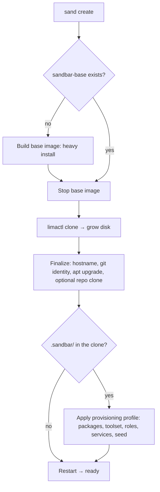

# How Provisioning Works

`sand` splits provisioning into two passes so the expensive work happens
once, not on every VM.

## The base image

The first time you create a VM, `sand` runs a heavy install
into a stopped Lima instance named `sandbar-base`. This installs the dev
tools, Claude Code, and everything else that every VM needs. See
[Available Tools](available-tools.md) for the full toolchain.

Because the base image carries no identity or secrets, it's safe to keep
around and reuse indefinitely — `sand` rebuilds it automatically if the
underlying provisioning logic has changed since it was built, or you can
force a rebuild yourself with `sand create --rebuild` (or by deleting
`sandbar-base` and creating a new VM).

## Cloning

Every VM after the first is a `limactl clone` of the stopped base image,
grown to the disk size you asked for. Cloning a stopped VM is far cheaper
than reinstalling the whole stack, which is what makes each new VM fast.

## Finalize

A clone isn't ready to use yet — it's still an anonymous copy of the base
image. A light finalize pass sets the VM's hostname, writes your git
identity into it, runs `apt upgrade`, and optionally clones a project
repository into it. The VM restarts once at the end of finalize and is then
ready to use.

### Repo-checked-in provisioning profiles

If the repository finalize just cloned contains a committed `.sandbar/`
directory, one more step runs before the restart: `sand` discovers and
applies that repo's [provisioning profile](../using-sand/provisioning-profiles.md)
— installing its declared apt packages, reconciling its declared toolset,
including its declared Ansible roles, enabling its declared services, and
finally running its seed tasks. This is entirely per-clone: it never touches
the shared base image, and a repository without `.sandbar/` sees no change
in behavior at all. See [Provisioning Profiles](../using-sand/provisioning-profiles.md)
for the manifest format and the trust model.

## Why the split

Doing the heavy install once and sharing it across every VM keeps VM
creation fast without compromising isolation: identity is applied per-VM at
finalize time, so the shared base image never contains anyone's secrets or
git configuration.
