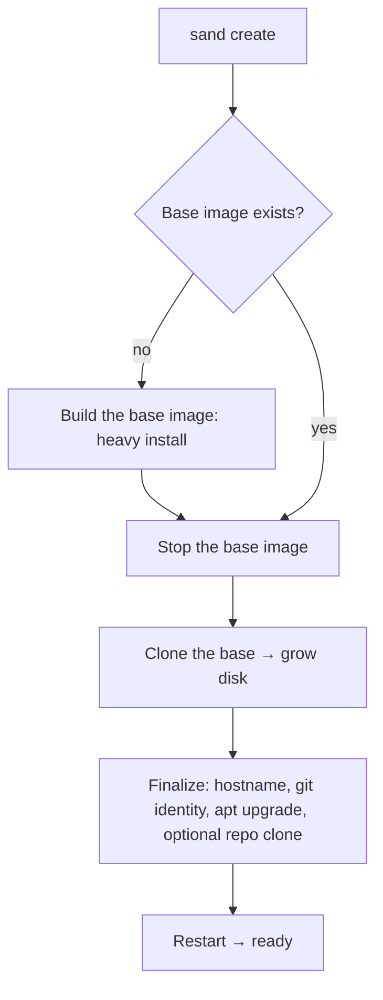

# How Provisioning Works

`sand` splits provisioning into two passes so the expensive work happens
once, not on every VM. This is the same everywhere a VM can run — on your
own machine, on a remote host, or on Proxmox.

```mermaid
graph TD
    A[sand create] --> B{Base image exists?}
    B -- no --> C[Build the base image: heavy install]
    C --> D[Stop the base image]
    B -- yes --> D
    D --> E[Clone the base → grow disk]
    E --> F[Finalize: hostname, git identity, apt upgrade, optional repo clone]
    F --> G[Restart → ready]
```

## The base image

The first time you create a VM, `sand` runs a heavy install into a stopped
VM named `sandbar-base`. This installs the dev tools, Claude Code, and
everything else that every VM needs. See [Available
Tools](available-tools.md) for the full toolchain.

Because the base image carries no identity or secrets, it's safe to keep
around and reuse indefinitely — `sand` rebuilds it automatically if the
underlying provisioning logic has changed since it was built, or you can
force a rebuild yourself with `sand create --rebuild` (or by deleting
`sandbar-base` and creating a new VM).

Each place you run VMs gets its own base image, built the first time you
create a VM there. A base image on your laptop and one on a server are
separate, and neither is copied to the other.

## Cloning

Every VM after the first is a copy of the stopped base image, grown to the
disk size you asked for. Copying a stopped VM is far cheaper than
reinstalling the whole stack, which is what makes each new VM fast.

## Finalize

A clone isn't ready to use yet — it's still an anonymous copy of the base
image. A light finalize pass sets the VM's hostname, writes your git
identity into it, runs `apt upgrade`, and optionally clones a project
repository into it. The VM restarts once at the end of finalize and is then
ready to use.

## Why the split

Doing the heavy install once and sharing it across every VM keeps VM
creation fast without compromising isolation: identity is applied per-VM at
finalize time, so the shared base image never contains anyone's secrets or
git configuration.

## How each backend does it

The shape above is identical everywhere; only the mechanics differ.

| | On your machine or a remote host | On Proxmox |
| --- | --- | --- |
| Runs VMs with | [Lima](https://lima-vm.io), via `limactl` | The Proxmox REST API |
| The base image is | a stopped Lima instance | a PVE template, built from a cloud image |
| A new VM is | `limactl clone` of it | a PVE clone of that template |
| `sand` reaches the guest over | `limactl shell`, or SSH for a remote host | SSH, to the address the guest agent reports |

For a remote host, `sand` runs the same `limactl` commands it would run
locally — it only changes *where* they run. See [Where VMs
Run](../using-sand/connection-profiles.md).
