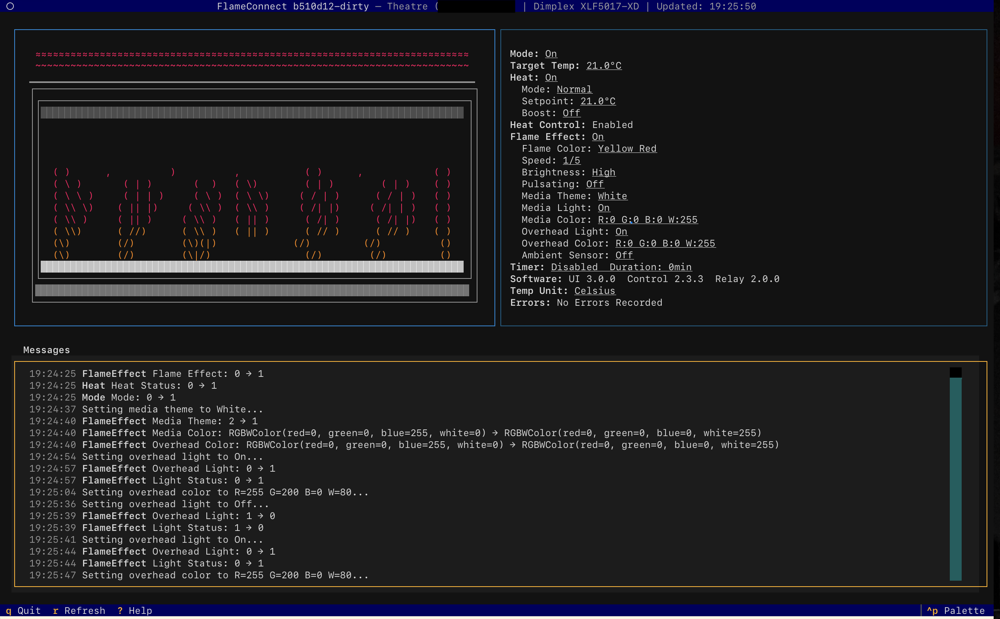

# sand TUI — five redesign concepts

*A brainstorm, not a decision.* Five distinct directions for what the `sand`
TUI could become, each with a description, pros/cons, feasibility notes, and
ASCII mockups (wide **and** narrow, because responsiveness is a theme
throughout). Pick one, mix two, or use them as a menu of parts.

The prettier, shareable version of this doc is the companion HTML artifact
([`concepts.html`](concepts.html)).

---

## Where this came from

The spark was [FlameConnect](https://github.com/deviantintegral/flameconnect)
— a Bubble Tea TUI that *feels crafted*: a persistent top status band with a
live clock, two side-by-side bordered panes (an animated visualization on the
left, an interactive key/value inspector on the right whose editable values are
underlined), a full-width scrollable **Messages** event-log pane with
timestamps, a footer command bar, and a `^p` command palette. The reference
screenshot is saved at
[`images/flameconnect-0.1.0-reference.png`](images/flameconnect-0.1.0-reference.png).



These concepts were generated by a 16-agent research-and-ideation workflow: five
parallel investigations of best-in-class terminal UIs (k9s, lazygit,
lazydocker, gh-dash, yazi, superfile, soft-serve, glow, Textual, Helix), a
synthesized design brief, eight concept generators each seeded with a distinct
north-star, and a design-director pass that selected and refined the strongest,
most *different* five.

## Where sand is today (the baseline these push against)

`sand` is a single-screen app: a `view` enum swaps the whole terminal between
eight full-screen states — `viewList` (a 7-column VM table), `viewDetail`,
`viewForm` (an 11-field create form), `viewProgress` (a full-screen scrolling
Ansible log), `viewBrowse` + `viewDest` (file transfer), and `viewSecrets` +
`viewSecretForm`. Navigation is one screen deep; actions are single keys
(`n`/`s`/`x`/`r`/`d`/`f`/`/`/`S`/`enter`) with a delete-confirm overlay and an
incremental name search.

Three recurring pain points every concept below is trying to fix:

1. **Screen-swap navigation.** Reading one VM means leaving the list; you can
   never scan the fleet and inspect a VM at the same time.
2. **Provisioning takes the screen hostage.** `beginStream` flips to
   `viewProgress` and `m.running` freezes every key for minutes — you can't
   queue a second VM while one builds.
3. **Keybinding pressure and drift.** The single-key space is crowded and
   overloaded: `d` is delete *and* download, `s` is start *and* secrets, `r` is
   restart *and* recreate *and* refresh-token. `defaultKeys()` and `viewHelp()`
   are hand-maintained in parallel and can disagree.

---

## Build these three foundations once, then A/B the shells

The most useful finding from the workflow: **four of the five concepts want the
same engine underneath.** Build these once and you can prototype several shells
cheaply.

- **A single action registry** — one `Command{name, keys, help, enabledFor(vm),
  run}` list that the keymap, footer help, which-key popup, *and* command
  palette all render from. Kills the `defaultKeys()`/`viewHelp()` drift, and
  `enabledFor(vm.Status, managed)` gives you state-gated verbs for free (a
  stopped VM never offers Stop).
- **A VM-keyed concurrent job registry** — generalize today's single
  `beginStream` reader/output/cancel triple into a `map[vmName]job` so several
  provisions/transfers/syncs run and stream at once while the UI stays live.
  This is the load-bearing change that un-freezes provisioning.
- **A persistent, revisitable run history** — promote the overwritten
  `m.status` string and the ephemeral provision output into a
  `[]run{id, verb, target, status, elapsed, logBuf}` keyed by VM name, so a
  failed Ansible run is still readable ten minutes later. This is the single
  highest-leverage UX win in the whole set.

Two cross-cutting disciplines every concept should adopt regardless of which
shell wins:

- **Responsive `classify(w, h) → layoutMode`** — one function per
  `WindowSizeMsg` picks the layout and sheds the least-essential pane/columns
  first, so the worst case is a working colorized roster, never a "terminal too
  small" wall. Replaces the scattered `width-6`/`width-8` magic offsets.
- **Idle-gating** — extend today's "spinner stops when `!running && !acting`"
  rule to *every* animation, so an idle `sand` draws zero CPU on battery/SSH.

A note on **Bubble Tea / Lipgloss v2**: floating overlays (palette, wizards,
confirms over a dimmed frame) and flicker-free whole-screen repaints want v2's
compositor (`PlaceOverlay`) and cell-diffing renderer. Every concept can ship a
v1 skeleton first and take the v2 migration to unlock the polish layer.

---

# The five concepts

| # | Concept | One-line | Paradigm | Build size |
|---|---------|----------|----------|-----------|
| 1 | **Living Cockpit** (Hangar ⊕ Tidepool) | k9s-style flight deck with a real per-VM heartbeat | Dense always-on dashboard | L (incremental) |
| 2 | **Lantern** | A calm, near-empty room you light with `^p` | Palette-first minimalism | M–L |
| 3 | **sandmodal** | The fleet is an editable buffer; verbs are edits | Modal / vim bulk power-tool | L |
| 4 | **Strata** | A file manager for your fleet: bases › clones › files | Spatial Miller-columns drill | L (biggest) |
| 5 | **Harbormaster** | A marina slip-board of live VM tiles | 2D card grid | M–L |

The five deliberately span five *different* interaction paradigms — a dense
dashboard, a minimalist palette room, a modal bulk-editor, a hierarchical drill,
and a spatial card board — so you see the real breadth of the space, not
variations on one theme.

---

## 1 · Living Cockpit — the dashboard you never leave

> **Hangar ⊕ Tidepool.** A k9s-style flight deck: fleet gauges up top, VM roster
> and a live inspector side by side, a docked activity log where provisioning
> streams in without ever taking over the screen — and a real per-VM *heartbeat*
> so you can see at a glance which disposable sandbox has a Claude agent hard at
> work.

**North star:** a cockpit you never leave. Like k9s or lazygit, the frame is
fixed and only the interior changes — you scan the whole fleet, read one VM's
vitals, and watch a clone provision itself, all on one screen, without a single
view swap.

This is the most literal descendant of the FlameConnect reference, and the
strongest anchor of the set. It merges two closely-related concepts: **Hangar**
supplies the cockpit bones (fleet band, roster + inspector, docked activity log,
palette) and the un-freezing of provisioning; **Tidepool** supplies the one
signature that makes it feel *alive* rather than merely tidy — a heartbeat
sparkline per running VM, fed by a ring buffer of the guest's load average. A
sandbox where an agent is building shows a tall moving pulse; an idle one
flatlines; a stopped one shows a dim dash. Because the motion is bound to a real
signal, the beauty and the monitoring are the same thing.

Today's `viewList → enter → viewDetail` swap disappears: moving the roster
cursor re-renders the inspector live. Secrets and transfer stop being separate
screens — the inspector shows a one-line secrets summary and lifecycle verbs act
on the highlighted row in place. Long operations register as a job keyed by VM
name and stream into the Activity pane as a single live line, so you can create
`feat-search`, shell into `api-refactor`, and watch `claude-base` finish cloning
— all at once. Finished jobs settle into the log as timestamped, colour-coded
audit entries; press enter to expand one into its full scrolling output. The
fleet band answers the question you actually have before pressing `n`: *am I
about to over-commit this host?*

**Signature moment:** you press `:`, the deck dims, and a palette floats up. You
type `prov api` — the letters light across "⧉ Provision api-refactor" — and hit
enter. Instead of the screen blanking to two minutes of Ansible, a line slides
into the Activity pane: `⣾ api-refactor provisioning… TASK [claude : toolchain]
▕██░░░░░░░░░▏ 18%`. You arrow up to `feat-login`, press `S`, drop into a shell —
and below, that bar keeps climbing on its own until the roster's `◌` flips to a
green `●`. The build came to you instead of stealing the room.

```
┌ sand · fleet   ●3 running  ◌2 stopped  ✖1 broken    CPU ███████▏ 14/16    lima ▕████░░░░▏ 214/500G    ⟳ 14:32:07 ┐
└──────────────────────────────────────────────────────────────────────────────────────────────────────────────────┘

╭─ VMs · managed ──────────────────────────────────────────╮  ╭─ feat-login  ◂ claude-base ────────────────╮
│  NAME           STATUS    ♥ ACTIVITY      CPU  MEM  DISK  │  │ ● Running · up 2h14m                       │
│ ▸● feat-login   Running   ▂▄▆█▆▄▂  live     4   8G   38G  │  │ Base      claude-base                      │
│  ● sandbox-01   Running   ▁▂▅▇▆▃▂          2   8G   22G  │  │ Managed   yes (sand clone)                 │
│  ● api-refactor Running   ▂▄▆█▆▄▂ ⣾72%      4  16G   51G  │  │ CPUs 4    Mem 8 GiB    Arch aarch64        │
│  ◌ feat-search  Stopped   ──────────       2   8G   19G  │  │ Disk 38 / 100 GiB  ▕███░░░░░░░▏ 38%         │
│  ◌ hotfix-ci    Stopped   ──────────       2   8G    9G  │  │ Dir  ~/.lima/feat-login                    │
│  ✖ old-spike    Broken    ──────────       –   –    –    │  │────────────────────────────────────────────│
│  □ claude-base  Stopped   ·  dormant       8  16G   14G  │  │ Secrets   github ✓ · dir_env 2 · global 1  │
│                                                          │  │ Last      provisioned 2h ago · secret sync │
╰──────────────────────────────────────────────────────────╯  ╰────────────────────────────────────────────╯

╭─ Activity ─────────────────────────────────────────────────────────────────────────────────────────────────────╮
│ 14:30:04  ⣾  api-refactor  provisioning… TASK [claude : install toolchain]   ▕████████░░░▏ 72%                 │
│ 14:31:52  ✓  feat-login    clone base → ready (1m48s)                                                          │
│ 14:28:11  ✓  feat-login    secret written · github token synced (effective next git/gh call)                  │
│ 14:22:39  ✖  old-spike     start failed: qemu: could not open disk image  (press enter to see log)            │
╰────────────────────────────────────────────────────────────────────────────────────────────────────────────────╯
 ↑↓ move   enter log   n new  s start  x stop  r restart  S shell   u/d transfer   f managed   / find   : palette   q quit

        · · · pressing ':' dims the deck and floats the palette · · ·
        ╭─ : prov ───────────────────────────────────────────────╮
        │ > prov                                                  │
        │  ⧉ Provision  api-refactor            n                 │
        │  ⧉ Recreate   feat-login (from claude-base)   d,r        │
        │  ⇢ Go to VM   api-refactor                              │
        │  ✎ Refresh GitHub token  feat-login                     │
        ╰─────────────────────────────────────────────────────────╯
```

**Narrow reflow** — the inspector collapses to one line and the roster sheds
`MEM`/`DISK` before the Activity pane, so the narrowest floor is roster + footer:

```
┌ sand 6VM ●3◌2✖1 · CPU 14/16 · ⟳14:32:07 ┐
└──────────────────────────────────────────┘
╭─ VMs · managed ──────────────────────────╮
│ ▸● feat-login    Running  ▂▄▆█▆▄▂  4      │
│  ● sandbox-01    Running  ▁▂▅▇▆▃    2     │
│  ● api-refactor  Running  ▂▄▆█ ⣾72% 4     │
│  ◌ feat-search   Stopped  ─────────  2    │
│  ◌ hotfix-ci     Stopped  ─────────  2    │
│  ✖ old-spike     Broken   ─────────  –    │
│  □ claude-base   Stopped  ·dormant   8    │
╰──────────────────────────────────────────╯
╭─ feat-login ◂ claude-base ───────────────╮
│ ● Running · up 2h14m · agent building    │
│ 4 CPU · 8 GiB · 38/100 GiB · aarch64     │
│ secrets: github✓ dir_env2 global1        │
╰──────────────────────────────────────────╯
 ↑↓  enter  n s x S  u/d  : palette  q quit
```

**Key interactions**

- `↑↓` move the roster cursor — inspector re-renders live, no enter, no swap.
- `enter` expands the highlighted VM's newest job into full scrolling output;
  `esc` collapses.
- `n`/`s`/`x`/`r` create/start/stop/restart — the op streams into Activity, deck
  stays navigable.
- `Tab` cycles focus roster → inspector → activity (the focused pane gets a
  bright border).
- `:` opens the fuzzy palette overlay — matches verbs **and** live VM names.
- `ctrl+c` cancels the highlighted VM's in-flight job if one is running, else
  quits (same safety rule as today, now per-job).

**Refinements folded in (from the director's pass)**

- Make the heartbeat *structurally honest*: real motion only when the data is
  real, an ASCII fallback ramp for poor terminals, and throttled/batched load
  sampling (or a tiny guest agent) so it never hammers the host. The concept
  lives or dies on this signal being true.
- Reuse `beginStream`'s `io.Pipe → viewport` plumbing verbatim, multiplexed into
  the name-keyed job registry.
- Land the shared Command registry **first** — footer, palette, which-key, and
  status-gating all become views of it.

**Pros**

- Delivers the exact FlameConnect silhouette, mapped 1:1 onto sand's domain.
- Kills full-screen view swaps — list, detail, and secrets are co-visible.
- Un-freezes provisioning: queue and manage several VMs concurrently.
- The heartbeat is honest monitoring, answering "which box has an agent working,
  and which is idle and safe to delete?"
- The fleet band turns "am I about to over-commit the host?" into a glance.

**Cons**

- Biggest structural cost: decoupling streaming from the `viewProgress`
  takeover — concurrent jobs mean a registry of readers/outputs/cancels on a
  value-passed model.
- Dense by nature; the payoff scales with fleet size and may be overkill for a
  one-sandbox user.
- Whole-screen repaints on every refresh tick want v2's cell-diffing renderer to
  avoid flicker; the dimmed-deck palette is effectively a v2 feature.
- The heartbeat needs real per-guest load data, which Lima doesn't expose —
  polling `/proc/loadavg` per running VM per tick needs careful throttling or a
  guest agent.

**Feasibility:** L, but the cleanest incremental path of the set. A weekend gets
a live master-detail deck with a fake log (`JoinVertical(band,
JoinHorizontal(roster, inspector), activity, footer)`, gauges as filled runes,
glyph status column). The hard 60% is behavioural: refactoring `beginStream`
into a background job registry, three-pane focus routing, the palette overlay
(wants v2), and cursor-preserving auto-refresh. **Recommended path:** ship the
shell + live inspector + single-job docked streaming on v1, then migrate to v2
for the palette overlay and flicker-free dashboard.

---

## 2 · Lantern — the calm room you light on demand

> A calm, near-empty room of VMs that you light on demand: press `^p` to raise
> the lantern and every action — create, provision, secrets, transfer,
> lifecycle — is one fuzzy line away.

**North star:** a dark, quiet room you can see at a glance, lit only when you
raise a lantern. The default screen is deliberately almost empty — just your
fleet, breathing. There are no verb keys to memorize and no screens to get lost
in; the single fuzzy palette (`^p`) is the entire control surface. You don't
navigate sand, you *summon* it.

Lantern makes one radical bet: delete almost every single-key verb and route the
whole app through one floating palette. The resting screen is a low-chrome list
— status glyph, name, a whisper of detail — with a single dim footer. Movement
is arrows/`jk`; `enter` toggles a row open into an inline detail accordion (no
screen swap). That's the entire chrome.

The palette composes **verb and object in one fuzzy query**. Plain text filters
the list (`feat` narrows to `feat-login`/`feat-search`). A `>` prefix is command
mode, gated by the selected VM's state. The signature is that `>prov feat`
resolves *both halves at once* — verb "Provision" and object "feat-login" — into
one scoped result, so you never pick a target in a separate step. Each result
shows a right-aligned key chord (`^p p`) that quietly teaches you the shortcut as
you graduate from typing to muscle memory. The palette is also the command
thread: `>create` expands the card downward into a stepped wizard;
`>secret add` continues inline with password-echoed fields; help is just the
palette pre-seeded with `>`, so it can never drift.

**Signature moment:** you have twelve near-identical clones and want to
re-provision the login sandbox. You don't reach for a row or a verb key — you
press `^p` and type `prov feat`. One fuzzy line resolves both halves, shows a
single lit result "Provision → feat-login" with `^p p` whispered on the right.
Enter. The palette lowers and a single line appears at the foot of the still-calm
list — `⣷ feat-login provisioning ▓▓▓▓░░░ TASK [git] cloning…` — while the room
stays navigable, so you immediately raise the lantern again for the next one.

```
┌──────────────────────────────────────────────────────────────────────────────────────┐
│  sand                                                                        14:32:07  │
│                                                                                        │
│  ● sandbox-01     running      managed · 4 CPU · 8GiB · 12.4G used                      │
│  ● feat-login     running      managed · 2 CPU · 8GiB · 9.1G used      ‹ selected       │
│  ◌ feat-search    stopped      managed · 2 CPU · 8GiB · 6.0G used                       │
│  ◌ claude-base    stopped      base image · clone source                               │
│  ⣷ bugfix-2231    provisioning ▓▓▓▓▓▓░░░░  TASK [docker] pulling images…                │
│  ● misc-vm        running      unrelated                                               │
│                                                                                        │
│        ╭──────────────────────────────────────────────────────────────────────╮       │
│        │ ❯ prov feat▏                                        scope ▸ feat-login │       │
│        ├──────────────────────────────────────────────────────────────────────┤       │
│        │ ▍⚡ Provision — re-run playbook          →  feat-login        ^p p     │       │
│        │   ↻ Recreate from the base image        →  feat-login        ^p R     │       │
│        │   ✚ Create a new VM…                                          ^p n     │       │
│        │                                                                        │       │
│        │  ↵ run   ·   ⇥ complete   ·   ⌫ back a step   ·   esc close            │       │
│        ╰──────────────────────────────────────────────────────────────────────╯       │
│                                                                                        │
│  12 VMs · 3 running · 1 provisioning · ^p commands · ? help · q quit                    │
└────────────────────────────────────────────────────────────────────────────────────────┘
```

**Narrow reflow** — drops the detail clause, palette goes near-full-width:

```
┌ sand ───────────────────── 14:32 ┐
│  ● sandbox-01     running        │
│  ● feat-login     running ‹ sel  │
│  ◌ feat-search    stopped        │
│  ◌ claude-base    base           │
│  ⣷ bugfix-2231    prov ▓▓▓░░      │
│  ● misc-vm        running        │
│                                  │
│ ╭ ❯ prov feat▏ ▸ feat-login ─╮   │
│ │▍⚡ Provision   → feat  ^p p │   │
│ │  ↻ Recreate    → feat  ^p R │   │
│ │  ✚ Create VM…          ^p n │   │
│ │  ↵ run  ·  esc close        │   │
│ ╰────────────────────────────╯   │
│ 12 VMs·3 run · ^p cmds · ? · q    │
└──────────────────────────────────┘
```

**Refinements folded in**

- Mitigate the cold-start risk (an empty screen assumes you know `^p`): keep a
  persistent dim footer hint, seed the palette on first launch, and show a thin
  per-selection verb hint until the user has fired a few chords.
- Give long output an honest home — the docked chip expands into the *shared*
  revisitable run list, not a lossy one-liner (a 400-line Ansible failure can't
  live in a chip).
- Add the fleet-capacity line into the create wizard's base step so "am I about
  to over-commit?" stays answerable.

**Pros**

- Purest expression of the crafted, uncluttered feel: five screen types collapse
  into one calm surface plus an overlay.
- Kills the keybinding crisis outright — verbs live in a fuzzy registry, not on
  scarce letters. Adding "reprovision" later costs one registry entry.
- Verb+object-in-one-line is genuinely fast for a fleet of similarly-named
  clones, and doubles as jump-to-VM.
- State-gating means the palette structurally cannot offer nonsense.

**Cons**

- Cold-start discoverability is the real risk: a near-empty screen with no
  visible verbs is less obvious than today's labelled help bar.
- Typing-tax on repetitive work until chords are learned.
- Palette-hosted wizards are cramped — the 11-field create form is fiddly to
  page inside a floating card.
- Verb/object fuzzy composition is ambiguous at the edges (`set` could match
  Reset/Secret/Start and a VM named `settings-svc`); needs careful ranking and a
  visible resolved-scope line.

**Feasibility:** M–L. The mechanical parts are easy today (the single registry,
fuzzy matching via bubbles/list's `sahilm/fuzzy` dep, a lighter list render than
the current table, the docked chip reusing `beginStream`). The v2-motivated part
is compositing the floating card over a dimmed background (`PlaceOverlay`) and
hosting the create/secret wizards as inline palette pages. One real dependency
bet (v2) and one fiddly area (wizard-in-overlay). Could share the exact same
engine as concept #1 — the two are alternate shells over one core.

---

## 3 · sandmodal — the fleet is an editable buffer

> A modal, vim-lineage cockpit where the whole VM fleet is an editable buffer —
> compose counts, motions, marks, registers and `:ex` commands to drive many
> sandboxes at once at the speed of thought.

**North star:** *your fleet is a text buffer. Each VM is a line. Editing the
buffer edits the machines.* Everything vim/helix taught your fingers — modes,
counts, motions, visual-select, marks, registers, `:g/pattern/cmd` — repurposed
to bulk-drive Lima clones. Verbs are edits; the fleet is the document.

This is the only concept that treats **bulk fleet operations as the native
case** rather than a bolt-on — which is what a heavy user of dozens of
disposable clones actually does all day. One persistent screen (fleet band,
master-detail spine, docked Messages, and a vim statusline + command line);
you never swap screens, you change *mode*. NORMAL mode navigates and acts on the
current VM (`3x` stops three downward; `xip` stops the whole group block the
cursor sits in — the buffer is grouped into managed/base/unrelated paragraphs).
SELECT mode (`V`) turns the fleet into a multi-select: extend a range, toggle
individual VMs, then apply one verb — or one `:ex` command — to the whole
selection with a single grouped confirm that lists exactly what will happen.
COMMAND mode (`:`) is the palette the user wants, as an ex line: `:g/feat-/d`
tears down every feature sandbox; `:g/Running/stop` drains the fleet. Registers
make "another box exactly like `feat-login`" trivial — `yy` yanks its recorded
`CreateConfig`, `p` pastes it as a new clone. Marks pin the boxes you live in.

**Signature moment:** you type `:g/feat-/x` and hit enter. Messages instantly
echoes "matched 3 → feat-login · feat-search · feat-payments", each matched row's
glyph spins, and one by one they flip `◌ Stopped` as the parallel `limactl`
stops land — the whole feature-branch fleet drained to sleep from a
five-character sentence, while you're already typing `yyp` to spin up the next
clone.

```
 sand · fleet  ●3 running   ◌3 stopped   ✖0 broken · base:1              updated 14:03:22

┌ Fleet ─────────────────────────────────────┐┌ Inspector · feat-login ───────────────────┐
│   NAME             STATUS      CPU   MEM    ││  ● Running     managed (sand)    ↻ base    │
│   claude-base      ◌ Stopped    8c   16G    ││    cloned from  claude-base                │
│   sandbox-01       ● Running    4c    8G    ││                                            │
│ s sandbox-02       ◌ Stopped    4c    8G    ││  CPUs   4            Memory   8GiB          │
│8▊ feat-login       ● Running    4c    8G    ││  Disk   12.4G / 100G  ▓▓░░░░░░░░░░  12%     │
│ ▊ feat-search      ● Running    4c    8G    ││  Arch   aarch64                            │
│ ▊ feat-payments    ◌ Stopped    2c    4G    ││  Dir    ~/vms/feat-login                   │
│   old-poc          ◌ Stopped    2c    4G    ││                                            │
│                                             ││  Secrets  3  ▸ 2 dir_env · 1 github        │
│                                             ││  Marks    s→sandbox-02   8→feat-login       │
└──────────────────────────── 3 selected ─────┘└  Reg  a: config←sandbox-01 (yank) ──────────┘
┌ Messages ──────────────────────────────────────────────────────────────────────────────┐
│ 14:03:04  clone claude-base → feat-search … ok (4.2s)                                    │
│ 14:03:11  secret written to feat-login (github:default) — effective next git/gh call     │
│ 14:03:22  :g/feat-/x  matched 3 → stopping feat-login · feat-search · feat-payments …    │
└──────────────────────────────────────────────────────────────────────────────────────────┘
 -- SELECT --   3 sel   feat-login   5/7        reg a←sandbox-01        2x pending
:'<,'>stop
```

**Narrow reflow** — inspector zooms on `space`/`Enter`, Messages → one line:

```
 sand ●3 ◌3 ✖0 · base:1      14:03:22

┌ Fleet ─────────────────────────────┐
│   NAME           STAT   CPU  MEM    │
│   claude-base    ◌ St    8c  16G    │
│   sandbox-01     ● Ru    4c   8G    │
│ s sandbox-02     ◌ St    4c   8G    │
│8▊ feat-login     ● Ru    4c   8G    │
│ ▊ feat-search    ● Ru    4c   8G    │
│ ▊ feat-payments  ◌ St    2c   4G    │
│   old-poc        ◌ St    2c   4G    │
└──────────── 3 selected ─────────────┘
 last: :g/feat-/x → 3 stopping …
 -- SELECT --  3 sel  feat-login  5/7
:'<,'>stop
   (space: inspector · ?: keys)
```

**Refinements folded in**

- De-risk the schedule: ship NORMAL + SELECT + a minimal exact-token `:` first,
  then add `:g/pattern/verb`, registers, and marks. The ex-parser and the
  hand-rolled multi-select table are where slippage lives.
- Make the pattern-match preview + grouped confirm **mandatory** before any bulk
  destructive verb — bulk delete is the sharpest footgun in the set.
- Borrow Lantern's "typing teaches the chord" tutor and a helix `<space>`
  which-key leader so the modal grammar is discoverable for newcomers.

**Pros**

- Bulk operations are the native case, not a bolt-on — stop/delete/start/secret
  a dozen clones in one keystroke or one `:g` line.
- The command line is the palette the user asked for, but strictly more
  powerful: ranges and `:g/pattern/verb` turn "select then act" into one
  declarative sentence.
- Registers make "another box like this one" trivial (`yyp`), leveraging sand's
  already-recorded `CreateConfig` snapshots — a genuinely new workflow.
- Muscle memory transfers instantly from vim/helix/k9s/lazygit, and the grammar
  composes so the verb set grows without eating free keys.

**Cons**

- Steep for newcomers and the *opposite* of discoverable — the which-key menu and
  `?` reference are essential mitigations, not optional polish.
- `bubbles/table` has no multi-selection or per-row marking, so the Fleet buffer
  must be hand-rolled — the single biggest build cost.
- The `:ex` language is real language-design work with real edge cases.
- Bulk + concurrent lifecycle is genuinely dangerous: `:g/feat-/d` can wipe six
  VMs; the confirm must be bullet-proof.

**Feasibility:** L. The frame and spine are easy; the mode state machine is
medium (a mode enum + a small pending buffer threaded through the existing
key-dispatch). The two hard parts are the hand-rolled multi-select buffer (a
`bubbles/table` replacement) and the `:ex`/`:g` parser. Registers/marks are easy
(in-model maps, persisted like the existing registry). **Ship order:** NORMAL +
SELECT + minimal `:` first; add `:g`/registers/marks second.

---

## 4 · Strata — a file manager for your fleet

> Sand becomes a file manager for your VM fleet: one spatial drill — bases ›
> clones › facets › guest files — with a live preview pane that is always one
> level ahead of your cursor.

**North star:** yazi/Finder for a Lima fleet. There is no "list screen" and
"detail screen" — there is one hierarchy you walk rightward and back out
leftward, and a preview that renders whatever your cursor points at, one level
deeper. The heavy base images are the roots; managed clones hang off them; each
clone opens into facets (Overview / Files / Secrets / Config / Provision log);
and the Files facet keeps drilling *right into the guest filesystem*.

Strata replaces sand's eight swapping views with a single Miller-columns spine.
Column 1 is Bases (each `claude-base`, `php83-base`, plus an "Other VMs" bucket);
selecting one populates Column 2, Clones; selecting a clone populates Column 3,
Facets; and the rightmost pane is always a live preview of whatever the cursor
rests on. Navigation is pure vim/Finder: `j/k` within a column, `l`/`→`/`Enter`
drills right, `h`/`←`/`Esc` backs out. The signature is that **the drill does
not stop at the VM boundary** — drill into Files and the columns become the guest
filesystem, and uploading is no longer a separate wizard: you drill to the target
guest directory and press `u` to push a host file into where your cursor already
is. This collapses `viewList`, `viewDetail`, `viewSecrets`, `viewSecretForm`,
`viewBrowse`, *and* `viewDest` into one coherent spatial model — and reuses
`browse.GuestLister`/`LocalLister` almost as-is.

**Signature moment:** you walk `claude-base › feat-login › Files`, keep pressing
`l`, and the very same motion that scanned your fleet is now walking the guest
checkout — `src/ › components/ › Button.tsx` — with the rightmost pane
live-previewing the file's head over `limactl`. Press `u` on a directory and a
host file drops straight into where your cursor already sits. Fleet, VM, and the
file inside a running guest are one continuous surface.

```
╭ sand ───────────────────────────────────── 6 VMs · 3 running · 3 stopped · Updated 14:22:07 ╮
│ claude-base › feat-login › Files                                                             │
╰─────────────────────────────────────────────────────────────────────────────────────────────╯
╭─ Bases ────────╮╭─ Clones (claude-base) ───╮╭─ Facets ──────╮╭─ feat-login · Files ───────────╮
│ ● claude-base  ││ ● feat-login            ▸││   Overview    ││ ~/proj/acme/web                │
│ ◌ php83-base   ││ ● sandbox-01             ││ ▸ Files       ││  ▸ src/            4 items      │
│                ││ ◌ hotfix-2311            ││   Secrets   3 ││    tests/          2 items      │
│ ── Other VMs ──││ ◌ feat-login-old         ││   Config      ││    .git/                        │
│ ● docker-lima  ││ + New clone…             ││   Provision ▸ ││    README.md       1.2 KB       │
│                ││                          ││               ││    package.json    834 B        │
│                ││                          ││               ││    docker-compose  512 B        │
│                ││                          ││               ││                                │
│                ││                          ││               ││  enter ▸ drill · u upload here  │
╰────────────────╯╰──────────────────────────╯╰───────────────╯╰────────────────────────────────╯
 focus ▸ Facets    ● running  ◌ stopped
 h ◂ back   l ▸ drill   n new   space verbs   / search   ^p palette   ? help   q quit
```

**Narrow reflow** — collapses to one column + a preview pane below it:

```
╭ sand · 6 VMs 3▶3◌ · 14:22:07 ────────────────╮
│ claude-base › feat-login › Files             │
├──────────────────────────────────────────────┤
│ Facets                          feat-login   │
│   Overview                                   │
│ ▸ Files                                      │
│   Secrets                              3     │
│   Config                                     │
│   Provision log                          ▸   │
├─ preview · Files ────────────────────────────┤
│ ~/proj/acme/web                              │
│  ▸ src/    tests/    README.md   pkg.json    │
│  enter ▸ drill into src/ · u upload here     │
├──────────────────────────────────────────────┤
│ h ◂ back   l ▸ drill   space verbs  ^p  ?  q │
╰──────────────────────────────────────────────╯
```

**Refinements folded in**

- Non-negotiable for viability: debounced, cursor-keyed async preview commands
  with a per-path cache and stale-result dropping, or fast `j/k` over a big guest
  directory spawns a `limactl` per hover and janks the UI.
- Give lifecycle verbs (start/stop/restart/shell/delete) a real home — they have
  no spatial place in a pure drill — via a `space` which-key popup plus the
  shared palette.
- Gate the Config-facet "edit an underlined value → queue a recreate" behind an
  explicit confirm; heavy rebuild semantics are too easy to trigger by accident.

**Pros**

- One mental model for the whole app: fleet scan, VM inspection, secrets, file
  transfer, and provisioning are all the same left-right drill.
- The file-transfer flow is dramatically better — in-place drilling into the
  guest FS with a stat/head preview, reusing `browse.GuestLister` nearly as-is.
- Grouping clones under their base makes the base→clone relationship — sand's
  central domain concept — spatially obvious, which the flat table never did.
- Master-detail is inherent, not bolted on.

**Cons**

- Horizontal space is the enemy: four panes want ~100 cols; laptop split-panes
  feel the squeeze.
- Live preview spawns `limactl` per hover — real latency; requires the debounced
  cached preview machinery above.
- Lifecycle verbs have no honest spatial home — a slight regression from today's
  instant single-key `s/x/r`.
- The most ambitious option: close to a full rewrite of the view/navigation
  layer (even though the backend packages are reused).

**Feasibility:** L, the biggest of the set. Genuinely easy: the frame, the
side-by-side panes, focused-vs-dim borders, the status-gated footer, glyph
status. Massive reuse: `lima.Client`, `provision.Provisioner`, `registry`,
`secrets`, and crucially `browse.GuestLister`/`LocalLister` already do the
directory listing the Files columns need; `beginStream` already produces the
streamable log. The real new work is the multi-column focus/depth state machine,
the sliding-window layout math, the cached async preview, and persisting a
per-VM provision log to disk for the Log facet. The honest risk is scope.

---

## 5 · Harbormaster — a slip-board of live tiles

> A marina control board where every VM is a moored boat you can read at a
> glance — status, gauges, and badge on a live tile — and any tile zooms into a
> full inspector without leaving the deck.

**North star:** a harbormaster's slip board. `claude-base` is the boatyard;
every managed clone is a boat in its numbered slip. You stand at the board, see
the whole fleet's trim (CPU/mem/disk) and colours at once, act on the boat
you're looking at, and lean in to inspect one — you never leave the pier to
switch "screens."

Harbormaster replaces the one-screen enum with a single persistent surface: a
pinned status band, a responsive grid of VM tiles, a docked Messages strip, and
a footer command bar. Each VM is a rounded card ~30 columns wide showing a status
glyph+colour (`●` Running green, `◌` Stopped grey, `⣾` Building animated, `✖`
Broken red), a managed/base/ext badge, a one-line subtitle, three little gauges
(cpu, mem, and a *real* disk used/max bar from the VM struct), and a footer of
arch + uptime/idle. Arrow keys move a focus ring; the focused tile wears a bold
border. Single-key verbs aim at the focused tile; `enter` (or `z`) zooms it to
fill the deck as a tabbed inspector folding today's detail, secrets, progress,
and transfer into Overview / Provision / Secrets / Cargo tabs. This is the most
visually *warm and glanceable* of the set — it answers "what's running, what's
mine, what's full" in one look better than any table row.

**Signature moment:** you press `n`, fill the form, and instead of the screen
going dark with a full-screen Ansible dump, a fresh tile slides into an empty
slip wearing a `⣾ Building` badge and an in-place provisioning bar that fills as
Ansible marches through its roles (`docker · 7/19`). You arrow away to start
`sandbox-02`, glance back, and the bar has crept to 38% — then the tile flips to
`● Running` green and drops "bugfix-887 ready" into the log. The fleet grew a
boat while you watched.

```
 sand · fleet                                              updated 14:02:37 · ⟳ auto 5s
 6 VMs   3 ● running   2 ◌ stopped   1 ⣾ building              base ◌ claude-base
 host   cpu ▕████████░░░░▏ 16/20   mem ▕██████████░░░░▏ 44/64G   lima ▕█████░░░░░░░░░░░▏ 61/240G

╭─ claude-base ──────────────╮  ┏━ sandbox-01 ━━━━━━━━━━━━━━━┓  ╭─ bugfix-887 ───────────────╮
│ ◌ Stopped             base │  ┃ ● Running          managed ┃  │ ⣾ Building          managed │
│ shared base image          │  ┃ feat: login form work      ┃  │ clone → provisioning…      │
│ cpu  ▕██████░░░░▏ 6 vCPU   │  ┃ cpu  ▕████░░░░░░▏ 4 vCPU    ┃  │ ▕███████░░░░░░░░░░░▏ 38%    │
│ mem  ▕████████░░▏ 16 GiB   │  ┃ mem  ▕██████░░░░▏ 8 GiB     ┃  │ ansible: docker · 7/19      │
│ disk ▕███░░░░░░░▏ 18/ 40G  │  ┃ disk ▕█░░░░░░░░░▏ 12/100G   ┃  │ ^p watch live log          │
│ aarch64 · clone source     │  ┃ aarch64 · up 2h14m         ┃  │ aarch64 · started 14:01     │
╰────────────────────────────╯  ┗━━━━━━━━━━━━━━━━━━━━━━━━━━━━┛  ╰────────────────────────────╯

╭─ docs-rfc ─────────────────╮  ╭─ oldproject ───────────────╮  ╭┄ new sandbox ┄┄┄┄┄┄┄┄┄┄┄┄┄╮
│ ◌ Stopped          managed │  │ ● Running              ext │  ┊                            ┊
│ docs: architecture rfc     │  │ not sand-managed           │  ┊    press  n  to add a      ┊
│ cpu  ▕████░░░░░░▏ 2 vCPU   │  │ cpu  ▕████░░░░░░▏ 4 vCPU   │  ┊    fresh sandbox cloned    ┊
│ mem  ▕████░░░░░░▏ 4 GiB    │  │ mem  ▕██████░░░░▏ 8 GiB    │  ┊    from  claude-base       ┊
│ disk ▕█░░░░░░░░░▏ 5/ 60G   │  │ disk ▕████░░░░░░▏ 22/ 80G  │  ┊                            ┊
│ aarch64 · idle 3d          │  │ x86_64 · up 6d             │  ┊    ~30s · disposable       ┊
╰────────────────────────────╯  ╰────────────────────────────╯  ╰┄┄┄┄┄┄┄┄┄┄┄┄┄┄┄┄┄┄┄┄┄┄┄┄┄┄╯

 messages ──────────────────────────────────────────────────────────────────────────────────
 14:01:52  clone base → bugfix-887 created · provisioning…
 14:00:31  secret written · sandbox-01 (github token, effective next git call)
 13:58:04  feat-login → sandbox-01 started

 ↑↓←→ move   enter zoom   n new   s start · x stop   S shell   ^p palette   ? help   q quit
```

**Narrow reflow** — one full-width tile focused, a compact roster for the rest:

```
 sand · fleet          14:02:37 ⟳5s
 6 VMs · 3● 2◌ 1⣾ · host 16/20c 44/64G

┏━ sandbox-01 ━━━━━━━━━━━━━━━━━━━━━━━┓
┃ ● Running                 managed ┃
┃ feat: login form work             ┃
┃ cpu  ▕████████░░░░░░░░▏ 4 vCPU     ┃
┃ mem  ▕██████████░░░░░░▏ 8 GiB      ┃
┃ disk ▕██░░░░░░░░░░░░░░▏ 12/100 GiB ┃
┃ aarch64 · up 2h14m · managed      ┃
┗━━━━━━━━━━━━━━━━━━━━━━━━━━━━━━━━━━━━┛
╭─ bugfix-887 ──────────────────────╮
│ ⣾ Building                managed │
│ clone → provisioning claude-base  │
│ ▕██████████░░░░░░░░░░░░░░▏ 38%     │
│ ansible: docker-role · task 7/19  │
│ aarch64 · 14:01 · ^p to watch     │
╰───────────────────────────────────╯

 more ──────────────────────────────
 ◌ claude-base  base  6c/16G  18/40G
 ◌ docs-rfc     mgd   2c/ 4G   5/60G
 ● oldproject   ext   4c/ 8G  22/80G

 ↑↓ move · enter zoom · n new · ^p ▸
 s start · x stop · S shell · q quit
```

**Refinements folded in**

- Fix the density weakness head-on: tiles are far less dense than a table (~6
  fit before scrolling), so make the narrow-mode compact roster a first-class
  toggle at *every* width, with sorting — a 30-clone shop must not be forced to
  scroll a grid.
- Be honest about gauges: Lima only knows *allocated* cpu/mem, so label those
  bars as allocation-vs-host, not live utilization — or graft the heartbeat only
  if sampling can be made cheap. Don't imply telemetry the tool lacks.
- Strict idle-gating and a capped frame rate on the animated build bars.

**Pros**

- Delivers the FlameConnect "crafted" feel directly: fixed frame, live interior,
  one board that reflows instead of jarring full-screen swaps.
- At-a-glance fleet scanning — colour+glyph, badge, and a real disk bar answer
  "what's running, what's mine, what's full" in one look.
- Zoom folds four of today's views into one inspector.
- Committed-vs-host capacity header is a genuine "am I about to over-commit?"
  safety win.

**Cons**

- Tiles are far less information-dense than a table — needs the compact-roster
  fallback and sorting.
- The cpu/mem gauges imply live utilization sand doesn't have; honest bars must
  read as allocation-vs-host.
- Biggest lift is the board itself: a new render path plus 2D focus routing.
- Zoom/confirm overlays and flicker-free full-board repaints want v2.

**Feasibility:** M–L. Easy today: the three-region frame, tiles as bordered
blocks, glyph+colour and the disk bar (real data), the header gauges, a
state-gated footer. Moderate: 2D focus routing, the breakpoint classifier, the
fuzzy palette, auto-refresh. Hard / v2-preferred: the zoom inspector and
overlays, flicker-free repaints, and multiplexing the provisioner. The existing
commands (start/stop/restart/delete/shell, `beginStream`, `listCmd`, secrets,
transfer) are all reusable as-is — this is a re-composition of the view layer
plus a jobs registry, not a plumbing rewrite.

---

## Two concepts that were absorbed, not dropped

The workflow generated eight concepts; two were folded into the five above
because their best ideas make the survivors stronger than a thin standalone slot
would:

- **Tideline (CI-style run timeline)** — its great idea, promoting the transient
  `beginStream` into a durable, revisitable run registry, became the **shared
  run-history foundation** and the Living Cockpit's Activity log.
- **Tideline (responsive reflow)** — its headline, the same content morphing
  across breakpoints via one `classify(w, h)` function with graceful
  degradation, became the **cross-cutting responsive discipline** every concept
  adopts (and why each mockup above ships a narrow variant).

---

## A suggested way to read these

They aren't mutually exclusive. The recommendation from the workflow:

1. **Build the shared engine first** — the Command registry, the VM-keyed job
   registry, and the run history. It's the cheap part and every shell needs it.
2. **Prototype the Living Cockpit (#1) as the anchor** — it's the closest
   descendant of the reference you admire and has the cleanest incremental path.
3. **Keep Lantern (#2) in your pocket as the palette layer** — it can ride the
   same engine, so "cockpit with a great palette" and "calm palette-first room"
   are two settings of one build, not two projects.
4. **Treat sandmodal (#3), Strata (#4), and Harbormaster (#5)** as the more
   opinionated bets — pick one if its paradigm (bulk power-tool, spatial drill,
   or visual board) matches how you actually live in `sand`.

Everything here is a starting point for a conversation, not a spec.
