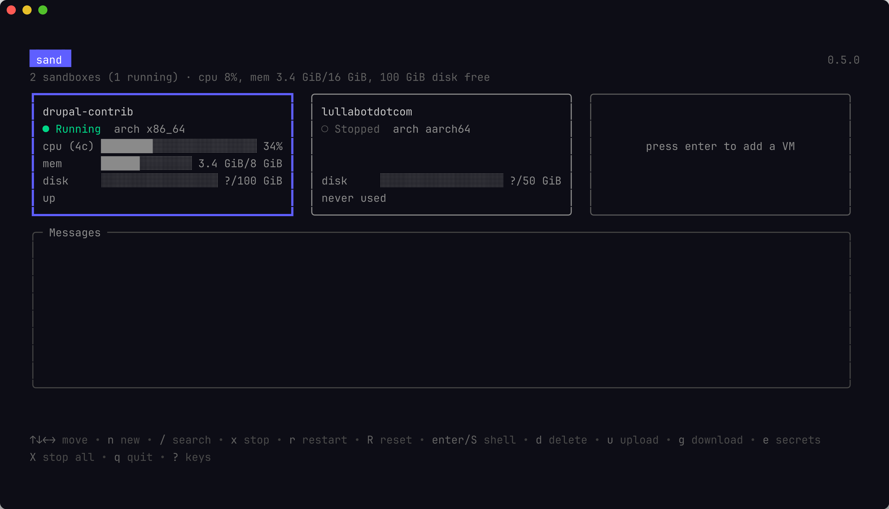

# The Board (TUI)

Running `sand` with no arguments opens a terminal UI: a **tile board**, one
tile per sand-managed VM. There is no table view and no per-VM detail
screen — both were deliberately removed. Every verb fires straight from the
tile under the focus ring.

## The header

The header shows a live readout of the **host(s)** you're connected to, not
the VMs: one band per active [Connection Profile](connection-profiles.md),
each with CPU and memory currently in use (fed by a guest heartbeat), free
disk on the volume that holds that profile's VMs, and the build's version.
With only the permanent Local profile enabled — sand's out-of-the-box
default — there's a single band and the header looks exactly like it always
has. Enable a remote profile and a second band appears for it; a profile
that's **disabled** or **errored** (unreachable, misconfigured) shows a
banner instead, naming the profile and the reason its tiles are absent. The
header does not count base images or unmanaged VMs — the board only ever
shows sand-managed clones, and the header doesn't either. Manage a base
image with `limactl` directly.

## The tile board

Tiles are sorted alphabetically by name and stay there — a VM changing
status never reorders the board. An empty slot on the board is a "ghost
tile" inviting you to press `enter` to create a VM.

With more than one [Connection Profile](connection-profiles.md) enabled, a
tile's title row also carries a small `[profile]` label naming which
profile that VM runs on — useful since the same VM name can exist under two
different profiles at once. The label is omitted while only the Local
profile is enabled, so a single-profile setup's tiles look unchanged.

Note: the paste-image verb (`v`) is only shown on running VMs.

Builds stream their output into a progress pane, but **they keep running in
the background if you navigate away**. Leaving the progress screen does not
cancel a build in progress; the job keeps going in the registry, and you can
reopen its log later (`l`) to see how it finished — including one that
failed while you weren't looking.

## Keybindings

### Board-level

These act on the board itself, regardless of which tile is focused.

| Key | Action |
| --- | --- |
| `↑` `↓` `←` `→` | Move the focus ring between tiles |
| `enter` (on the ghost tile) | Create a new VM |
| `n` | Create a new VM |
| `p` | Open the [Connection Profiles](connection-profiles.md) management screen |
| `/` | Search / filter tiles by name |
| `X` | Stop all — every **sand-managed** VM that's currently running, after a confirmation naming them. An unmanaged Lima instance or a base image is never touched, even if it's running, so an instance you use for unrelated work is safe. |
| `?` | Show the keys screen |
| `q` | Quit |

### On the focused tile

These fire on whichever tile the focus ring is currently on. Not every verb
is offered on every tile — for example `s` (start) only appears when the VM
isn't already running, and `S` (shell), `u` (upload), and `g` (download) all
require the VM to be running.

| Key | Action | What it does |
| --- | --- | --- |
| `s` | Start | Boot the VM. Its host-stored secrets are written into the guest as it comes up. |
| `x` | Stop | Shut the VM down cleanly. Its disk and its secrets are kept. |
| `r` | Restart | Stop the VM and start it again, applying any secrets you've changed since it booted. |
| `R` | Reset | Delete this VM and clone it fresh from its base image, keeping its name and sizing. Everything inside the guest is lost; the create form opens pre-filled so you can change the settings first. Only offered for VMs sand created. |
| `S` | Shell | Attach a shell to the guest's persistent tmux session. Work keeps running after you detach (`C-a d`) or close the terminal. See [Files and Shells](files-and-shells.md). |
| `v` | Paste Image | Stage the host clipboard's image on the guest clipboard, ready for Ctrl-V inside Claude Code in the guest. |
| `d` | Delete | Delete the VM and its disk, after a confirmation. Its host-stored secrets go with it. **Irreversible.** |
| `u` | Upload | Copy a file or directory from this machine into the guest. You pick the source, then the destination directory. See [Files and Shells](files-and-shells.md). |
| `g` | Download | Copy a file or directory out of the guest onto this machine. See [Files and Shells](files-and-shells.md). |
| `e` | Secrets | Edit this VM's secrets. Saving writes them into a running guest immediately; a stopped one gets them on its next start. See [Secrets](secrets.md). |
| `t` | Snapshot | Capture this VM as a golden template. Opens a one-field prompt for the template's user-facing name, then runs the snapshot in the background. The VM's power state is preserved. See [Golden Templates](golden-templates.md). |
| `l` | Log | Reopen the log of this VM's last build or file transfer — including one still running, or one that failed. |

`d` is always delete, on every screen — the most destructive key never
changes meaning under your fingers. Download deliberately does **not** use
`d`; it's bound to `g` instead.

For the full set of `sand` subcommands and flags (including `sand shell`),
see the [CLI Reference](cli-reference.md).

## Connection profiles

`p` opens the profile management screen — a list of every
[Connection Profile](connection-profiles.md) `sand` knows about (Local plus
any remote hosts you've added), with keys to create, edit, enable/disable,
and delete them. Every change there is live: enabling a profile builds its
connection and starts showing its tiles immediately, with no restart.

The create form (`n`, or `enter` on a ghost tile) also has a profile
selector when more than one profile is enabled, so you pick which profile a
new VM is created on without leaving the TUI. See
[Connection Profiles](connection-profiles.md) for the full model.

## Creating a VM

Pressing `n` (or `enter` on the ghost tile) opens the create form. With more
than one [Connection Profile](connection-profiles.md) enabled, a **Profile**
selector appears first, letting you pick which profile the VM is created on.
Below that, a **Source** selector (space or enter to open) picks the clone
source: the shared base image, or one of your named golden templates (if you
have any). The rest of the form is the same fields as `sand create`'s flags:
Name, Hostname, User, Git identity, CPUs, Memory, Disk, Docker proxy host,
Clone URL, and Clone token. Fill them in, then press `ctrl+s` to create.

See [Golden Templates](golden-templates.md) for what a template is and how to
snapshot one from an existing VM.

## Resetting a VM

Pressing `R` on a managed tile opens the create form again, titled *Reset
VM*, pre-filled with that VM's recorded settings. `Name` is locked; every
other field — CPUs, memory, disk, hostname, git identity, clone URL — is
editable, so a reset doubles as the way to resize a VM or change its
identity. Confirm with `ctrl+s` to delete the VM and re-clone it from the
base image with the edited settings; the new settings are then recorded, so
the *next* reset defaults to them.

Two **preserve toggles** follow the fields (space/enter flips the focused
one). Both default off:

- **Preserve Claude Code settings** keeps `~/.claude` and `~/.claude.json`
  (your Claude Code login and history) across the reset.
- **Preserve ~/&lt;host&gt;/&lt;org&gt;** — named for the exact directory it
  protects, e.g. `Preserve ~/github.com/lullabot` — keeps the cloned
  project's checkout and its `.env`. Enabling it also **skips the re-clone**
  during the reset's finalize pass, so you don't need to re-supply a clone
  token to reset a VM that had cloned a private repo (see
  [Reset and the token](secrets.md#reset-and-the-token)). This toggle is
  hidden entirely when the VM cloned no project, since there'd be nothing to
  preserve.

Enabling either toggle copies that data out of the VM to a private host
temp directory and restores it into the freshly cloned VM, then deletes the
temporary copy. The form warns that this moves your Claude Code login and
project token off the VM: **do not preserve if you suspect the VM is
compromised** — see [Security Model](../reference/security-model.md).
