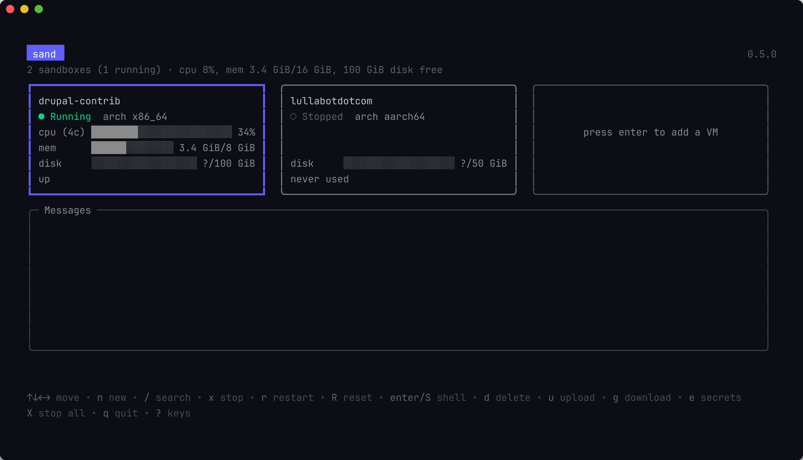

# The Board (TUI)

Running `sand` with no arguments opens a terminal UI: a **tile board**, one
tile per sand-managed VM. There is no table view and no per-VM detail
screen — both were deliberately removed. Every verb fires straight from the
tile under the focus ring.

## The header

The header shows a live readout of the **host(s)** you're connected to, not
the VMs: one band per active [Connection Profile](connection-profiles.md),
each with CPU and memory currently in use (fed by a guest heartbeat), free
disk on the volume that holds that profile's VMs, and the build's version.
Out of the box that's one band, for the permanent Local profile. Add a
remote or Proxmox profile and a second band appears for it; a profile that's
**disabled** or **errored** (unreachable, misconfigured) shows a banner
instead, naming the profile and the reason its tiles are absent. The header
does not count base images or unmanaged VMs — the board only ever shows
sand-managed clones, and the header doesn't either. Manage a base image with
`limactl` (or the Proxmox UI) directly.

## The tile board

Tiles are sorted alphabetically by name and stay there — a VM changing
status never reorders the board. An empty slot on the board is a "ghost
tile" inviting you to press `enter` to create a VM.

With more than one [Connection Profile](connection-profiles.md) enabled, a
tile's title row also carries a small `[profile]` label naming which
profile that VM runs on — useful since the same VM name can exist under two
different profiles at once. The label is omitted while only the Local
profile is enabled, so a single-profile setup's tiles look unchanged.

Note: the paste-image verb (`v`) is only shown on running VMs.

### Scrolling

The board only draws as many tile rows as the window is tall enough for —
in a short terminal that can be a single row. When there are more tiles than
fit, a **scroll bar** appears down the right-hand side: the solid part shows
how much of the board is on screen and where in it you are. Arrowing past the
edge of the window scrolls the board, so everything stays reachable. There is
no scroll bar when the whole board already fits, so seeing one always means
there is more.

Builds stream their output into a progress pane, but **they keep running in
the background if you navigate away**. Leaving the progress screen does not
cancel a build in progress; the job keeps going in the registry, and you can
reopen its log later (`l`) to see how it finished — including one that
failed while you weren't looking.

## Keybindings

### Board-level

These act on the board itself, regardless of which tile is focused.

| Key | Action |
| --- | --- |
| `↑` `↓` `←` `→` | Move the focus ring between tiles |
| `enter` (on the ghost tile) | Create a new VM |
| `n` | Create a new VM |
| `p` | Open the [Connection Profiles](connection-profiles.md) management screen |
| `/` | Search / filter tiles by name |
| `X` | Stop all — every **sand-managed** VM that's currently running, after a confirmation naming them. A VM `sand` didn't create, or a base image, is never touched, even if it's running, so a VM you use for unrelated work is safe. |
| `?` | Show the keys screen |
| `q` | Quit |

### On the focused tile

These fire on whichever tile the focus ring is currently on. Not every verb
is offered on every tile — for example `s` (start) only appears when the VM
isn't already running, and `S` (shell), `u` (upload), and `g` (download) all
require the VM to be running.

| Key | Action | What it does |
| --- | --- | --- |
| `s` | Start | Boot the VM. Its host-stored secrets are written into the guest as it comes up. |
| `x` | Stop | Shut the VM down cleanly. Its disk and its secrets are kept. |
| `r` | Restart | Stop the VM and start it again, applying any secrets you've changed since it booted. |
| `R` | Reset | Delete this VM and clone it fresh from its base image, keeping its name and sizing. Everything inside the guest is lost; the create form opens pre-filled so you can change the settings first. Only offered for VMs sand created. |
| `S` | Shell | Attach a shell to the guest's persistent tmux session. Work keeps running after you detach (`C-a d`) or close the terminal. Inside a host tmux session this opens a new window and leaves the board live; otherwise it suspends the board until you detach. See [Files and Shells](files-and-shells.md). |
| `v` | Paste Image | Stage the host clipboard's image on the guest clipboard, ready for Ctrl-V inside Claude Code in the guest. |
| `d` | Delete | Delete the VM and its disk, after a confirmation. Its host-stored secrets go with it. **Irreversible.** |
| `u` | Upload | Copy a file or directory from this machine into the guest. You pick the source, then the destination directory. See [Files and Shells](files-and-shells.md). |
| `g` | Download | Copy a file or directory out of the guest onto this machine. See [Files and Shells](files-and-shells.md). |
| `e` | Secrets | Edit this VM's secrets. Saving writes them into a running guest immediately; a stopped one gets them on its next start. See [Secrets](secrets.md). |
| `l` | Land | Open the Landing pane: list this VM's git checkouts and their branch/push/PR state, and open a one-shot draft PR, the branch's page in a browser, or — for a checkout on a drupal.org remote (`git.drupalcode.org` or `git.drupal.org`) — publish its local commits to drupal.org. See [Landing](files-and-shells.md#landing) and [Publishing to drupal.org](drupalorg-publishing.md). |
| `L` | Log | Reopen the log of this VM's last build or file transfer — including one still running, or one that failed. |

`d` is always delete, on every screen — the most destructive key never
changes meaning under your fingers. Download deliberately does **not** use
`d`; it's bound to `g` instead.

### The unlanded-work badge

A tile whose checkouts have been swept recently carries a small badge on its
footer row naming git work that has not yet reached a PR:

- **Actionable** (amber, `⚠ actionable`) — at least one checkout has a pushed
  branch of its own, so a PR is one `l` (Land) away. A checkout sitting on its
  repo's default branch doesn't count: a fresh clone is "pushed" in the literal
  sense but has nothing to turn into a PR, so it never lights the badge.
- **At-risk** (`↑N`, `unpushed`, and/or `dirty`, shown dimmed) — work that may
  be lost if the VM is deleted. `↑N` counts commits absent from every
  remote-tracking branch in the guest. `unpushed` marks a branch that has
  never been pushed, and `dirty` marks uncommitted changes.

    Comparing against all remote-tracking branches avoids counting upstream
    commits brought in by a rebase as your unpublished work. The count uses
    the guest's local Git records; it does not query remotes.

The badge shows nothing for a VM that has never been swept, is stopped, or
whose last sweep is stale — it never guesses.

### The delete guard

Pressing `d` on a VM whose checkouts hold work the registry has seen adds a
line to the confirmation naming what's at stake: unpushed commits and
uncommitted changes as **"lost on delete"**, and pushed-but-PR-less branches
as **"safe on GitHub"**. This reads only the host's own cached checkout
registry (the same data the badge above uses) — it never contacts the guest
to refresh it, so confirming delete on a VM you suspect is compromised never
triggers a round-trip into it. On a stopped VM the warning is labeled with
how long ago that data was last seen (`as of 3d ago`), since a stopped guest
cannot be re-swept.

For the full set of `sand` subcommands and flags (including `sand shell`),
see the [CLI Reference](cli-reference.md).

## Connection profiles

`p` opens the profile management screen — a list of every
[Connection Profile](connection-profiles.md) `sand` knows about (Local plus
any remote hosts you've added), with keys to create, edit, enable/disable,
and delete them. Every change there is live: enabling a profile builds its
connection and starts showing its tiles immediately, with no restart.

The create form (`n`, or `enter` on a ghost tile) also has a profile
selector when more than one profile is enabled, so you pick which profile a
new VM is created on without leaving the TUI. See
[Connection Profiles](connection-profiles.md) for the full model.

## Resetting a VM

The create form has independent **Install Claude Code**, **Install OpenAI Codex**,
**Install OpenCode**, and **Install Pi** checkboxes. New VMs start with your last
submitted choices (initially Claude Code only); reset starts with the choices
recorded for that VM and does not change global preferences.

Press `R` on a managed VM's tile to open the *Reset VM* form, filled with
its recorded settings. Change resources or settings as needed, then press
`ctrl+s` to delete and rebuild the VM. The next reset uses the new settings.

`Name` and `GitHub repo URL` are locked: a reset keeps the VM's identity and
project. Press `n` to create another VM for a different repository. The
`GitHub token` field stays editable because cloning a private repository
again requires a token.

The CLI equivalent is [`sand reset NAME`](cli-reference.md#sand-reset-name).

### Choosing what survives

Preserve options follow the settings. **All default off.** Press space or
enter to toggle the focused option; its help text describes what it copies.

- **Preserve the entire home directory** keeps your files while updating the
  VM. The home is restored before the playbook runs, so Ansible can update
  its configuration files. It includes the options below, which appear
  checked and locked while this option is on. It copies the most data and
  excludes `~/.ssh/authorized_keys`, so the rebuilt VM keeps its new access
  key. Directories named `.cache` are also left behind and rebuilt in the new
  VM.
- **Preserve agent settings and files** keeps settings, credentials, sessions,
  and history for Claude Code, Codex, OpenCode, and Pi together, including
  state from manual installs. Selected agents are installed fresh; restored
  configuration files are retained. See the
  [preserved paths](../reference/files-and-state.md#preserved-agent-state).
- **Preserve ~/&lt;host&gt;/&lt;org&gt;** keeps the organisation directory for
  the VM's cloned project, including the checkout, uncommitted work, and the
  `.env` beside it. If the checkout is present, the reset skips cloning it
  again, so a private repository needs no clone token. This option appears
  only when the VM has a configured project.
- **Preserve a checkout**, such as `Preserve ~/src/app`, keeps one checkout
  found by the background sweep. This includes linked worktrees. The help
  text shows the branch and when it was last seen. Checkouts within the
  project's organisation directory are covered by that directory's option
  and have no separate row. A VM with no cached sweep has no checkout rows;
  use the whole-home option if you need to keep its files.

Preserved data passes through a private directory on your workstation.
`sand` removes the copy after a successful reset. If a reset fails after
attempting to delete the VM, it keeps the archives and prints their path
for recovery. See [`sand reset`](cli-reference.md#sand-reset-name).

**Do not preserve data if you suspect the VM is compromised.** It can
include credentials and files written by an agent. See
[Security Model](../reference/security-model.md).

Only directories inside the guest home can be preserved. Paths outside it,
such as `/srv` or `/opt`, are rejected before the VM is deleted.
Directories named `.cache` are excluded from every preserved tree. This covers
the standard cache directory name used by the default `XDG_CACHE_HOME`; a
custom cache path with another name is preserved.
