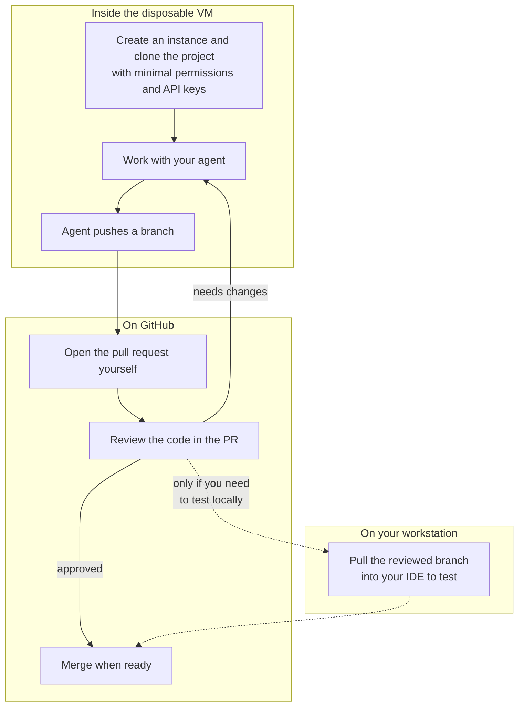
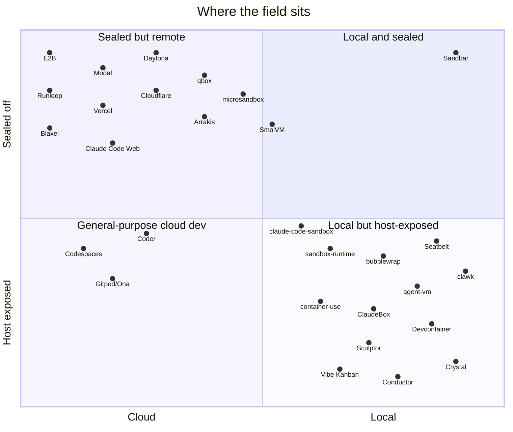

# Why Sandbar

AI coding agents become vastly more useful when you stop approving
their every move. Claude Code with `--dangerously-skip-permissions`,
and the equivalent on other agents, edits files, runs commands, and
pushes branches without pausing to ask.

The flag means what it says: an agent running that way can do whatever
the machine it runs on can do, including reading your SSH keys, editing
files, or affecting unrelated projects. And worst case, a compromised
agent (or a simple bad dependency) leaves your work at risk and a
cleanup job ahead.

Every practical answer to this trades away something. A container (like
Docker, Podman, etc) shares your host kernel (on Linux) and almost
always bind-mounts your repo, so the agent's reach extends back onto
your disk. To work safely, you have to review and approve each command.
A cloud sandbox moves the risk off your machine, but usually limits
what you can do. For example, Claude Code on the Web is _almost_ a
solution, except it doesn't support running containers or nested
virtual machines. Rolling your own VM gives you the right boundary, but
hands you all the work maintaining it and possibly entire new skills to
learn.

We wanted the autonomy of skip-permissions with a boundary the agent
genuinely cannot cross, while being easy to use even if you're not a
devops expert.

We hope Sandbar is the answer!

## Our Core Philosophies

**1. sandbar VM has no writable path back to your machine.**

**2. Agentic tools replace IDEs in most cases.**

Each VM is a full guest, not a container sharing your kernel. Its only
mount is the read-only provisioning playbook. Lima's stock host-home
share is forced off. The agent inside cannot see or touch your host
filesystem, and `limactl delete` provably removes everything the VM
ever produced, because there was never a channel for it to leave
anything behind. Files move in and out only when you upload or download
them on purpose. The [Security Model](reference/security-model.md)
spells out the full set of guarantees and their two deliberate
exceptions.

That property is what lets sandbar run the agent with permissions
skipped by default and treat it as safe rather than reckless. The
recovery model for a misbehaving agent isn't a hardened host. It's `R`
to reset the VM from a clean base image, or `d` to delete it. You get
the autonomy because the blast radius is one disposable VM and stops
there.

You might be asking: what risk is there really if a compromised or
off-track agent writes bad code?

If you open a fresh project in an IDE like IDEA or VS Code, you'll
notice it asking you if you trust the project. Unless you approve, a
whole slew of useful IDE features are disabled. That's because those
features read files in the checkout and execute them. They could be
package managers like npm, build scripts like webpack or Make, or other
tools based on the ecosystem the project is working in. An agent could
even write a hook in `.git/hooks` that instantly pivots out to the rest
of your workstation on the next `git` command.

### Recommended Workflow

With Sandbar, the recommended workflow is:

1. Create an instance and check out your project in to it with the
   minimum of permissions and API keys it needs.
2. Do work with your agent.
3. Have the agent push a branch. Open the PR yourself.
4. Review the code there and iterate.
5. If you need to test on your workstation, pull down the branch into a
   checkout on your IDE, but only after you've reviewed the code.

## What else is in the box

The hard boundary keeps things secure and repeatable. But without
helpful tooling, it's also a pain. Here's what we've added to Sandbar
to make it easier (and faster!) to use.

- **Setup happens once.** One base image carries the full toolchain
  (Docker, ddev, Node, Go, Python, a JDK, `gh`, tmux, direnv). Every VM
  after the first is a clone of it plus a light finalize pass for
  hostname, git identity, and an optional repo clone, so new
  environments come up in seconds. See
  [How Provisioning Works](getting-started/how-it-works.md).
- **A board and a CLI.** Run `sand` for a
  [terminal board](using-sand/tui.md) where every action fires from the
  focused tile, or script `sand create` and `sand shell` headlessly for
  CI. Builds keep running when you navigate away, and tmux sessions
  survive a disconnect because systemd linger is on.
- **Secrets stay off argv.** Clone tokens and
  [secret values](using-sand/secrets.md) stream into the guest over
  stdin into tmpfs and are removed on exit, so they never appear in a
  process listing on either side.
- **Least-privilege access is documented, not assumed.** The
  [Security Model](reference/security-model.md#a-least-privilege-token-reasonable-agent-access)
  walks through a fine-grained GitHub token that can push code and read
  pull requests and issues but cannot merge or close them, paired with
  branch protection, so an unattended agent can push branches for
  review yet cannot merge anything or push straight to your default
  branch.
- **Notifications come for free.** For supported agents, we enable
  Remote Control or similar features so you are alerted when the agent
  is waiting for you.

## How it compares

Running an agent in a local VM isn't unique to Sandbar.

The nearest neighbors are **clawk** and **agent-vm**, both recent.
[clawk](https://github.com/clawkwork/clawk), posted to Hacker News in
mid-July 2026, is close on the surface: a single Go binary you install
with Homebrew that gives a coding agent a local full VM with its own
kernel, already agent-agnostic across Claude, Codex, and others.
[agent-vm](https://github.com/sylvinus/agent-vm) is built on Lima, the
same backend sandbar uses today, is multi-agent, and even shares the
base-template-then-clone provisioning model.

Both make the opposite call on the decision above. clawk live-mounts
your repo over virtio-fs, and its own README notes that an agent can
therefore commit bad code that could run on your host. agent-vm mounts
your working directory read-write by default. That writable mount is
the convenient choice, because the agent edits the same files already
open in your editor, and it's the exact channel sandbar removes.

Everything else (as of July 2026) sits further off on one axis or
another:

| Tool(s) | Isolation | Local / Cloud | Gap vs sandbar |
|---|---|---|---|
| [clawk](https://github.com/clawkwork/clawk) | Full VM (Apple Virtualization / Firecracker) | Local | Live-mounts your repo writable; CLI-only; macOS-first |
| [agent-vm](https://github.com/sylvinus/agent-vm) | Full VM (Lima) | Local | Mounts working dir writable by default; Bash script; persistent, not disposable |
| [E2B](https://e2b.dev/), [Modal](https://modal.com/), [Daytona](https://www.daytona.io/), [Runloop](https://www.runloop.ai/), [Vercel Sandbox](https://vercel.com/docs/vercel-sandbox), [Cloudflare Sandbox](https://developers.cloudflare.com/), [Blaxel](https://www.blaxel.ai/) | microVM or gVisor | Cloud | Your code runs on someone else's machine; API-first |
| [Claude Code on the Web](https://claude.ai/code) | Container | Cloud | Unreliable network access, no Docker or container support |
| [Arrakis](https://github.com/abshkbh/arrakis), [microsandbox](https://github.com/superradcompany/microsandbox), [qbox](https://www.qbox.sh/), [SmolVM](https://particula.tech/blog/smolvm-vs-firecracker-sandbox-ai-generated-code) | microVM | Self-host / local | A sandbox SDK, server, or fleet infra, not an opinionated dev-VM workflow |
| [container-use](https://github.com/dagger/container-use), [claude-code-sandbox](https://github.com/textcortex/claude-code-sandbox), [ClaudeBox](https://github.com/RchGrav/claudebox), [Anthropic devcontainer](https://code.claude.com/docs/en/sandbox-environments) | Container (shared kernel) | Local | Shares your kernel and bind-mounts the repo |
| [Vibe Kanban](https://github.com/BloopAI/vibe-kanban), [Conductor](https://conductor.build/), Crystal, [Sculptor](https://imbue.com/sculptor/) | Host worktrees / containers | Local | Little or no isolation boundary; agent runs on the host |
| [sandbox-runtime](https://github.com/anthropic-experimental/sandbox-runtime), bubblewrap, Seatbelt | OS process confinement | Local | Per-process host confinement, policy-dependent, no provisioned environment |
| [Coder](https://github.com/coder/coder), Gitpod/Ona, Codespaces | Workspaces | Cloud / self-host | General-purpose remote dev, not agent-disposable |

The tools that get the VM boundary right still mount your files into
it, and the tools that restrict the environment do it in the cloud or
as an SDK rather than a local dev VM. Sandbar is the point where local,
full-VM, sealed, and disposable meet.

## Where it's going

Lima and Claude Code are the first supported backend and agent, not the
definition of the tool. The provisioning model is built to add more of
both: other agents behind the same disposable-VM workflow, and other
backends behind the same commands, with Proxmox and similar targets
planned so a Sandbar VM can land on a Mac Mini or a server, and not
only a laptop.
